MySQL  相关知识复习

## 1.MySQL 执行流程

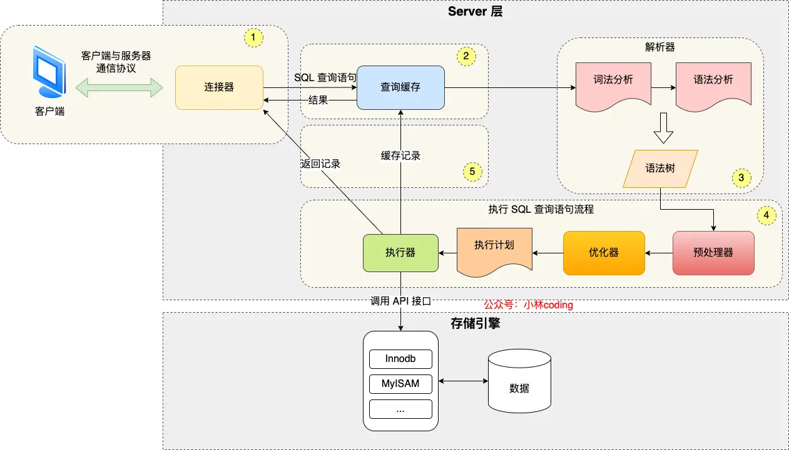

MySQL 的架构共分为两层：**Server 层和存储引擎层**：

- **Server 层负责建立连接、分析和执行 SQL**。MySQL 大多数的核心功能模块都在这实现，主要包括连接器，查询缓存、解析器、预处理器、优化器、执行器等。另外，所有的内置函数（如日期、时间、数学和加密函数等）和所有跨存储引擎的功能（如存储过程、触发器、视图等。）都在 Server 层实现。
- **存储引擎层负责数据的存储和提取**。支持 InnoDB、MyISAM、Memory 等多个存储引擎，不同的存储引擎共用一个 Server 层。现在最常用的存储引擎是 InnoDB，从 MySQL 5.5 版本开始， InnoDB 成为了 MySQL 的默认存储引擎。我们常说的索引数据结构，就是由存储引擎层实现的，不同的存储引擎支持的索引类型也不相同，比如 InnoDB 支持索引类型是 B+树 ，且是默认使用，也就是说在数据表中创建的主键索引和二级索引默认使用的是 B+ 树索引。

好了，现在我们对 Server 层和存储引擎层有了一个简单认识，接下来，就详细说一条 SQL 查询语句的执行流程，依次看看每一个功能模块的作用。

### 1.1 连接器

如果你在 Linux 操作系统里要使用 MySQL，那你第一步肯定是要先连接 MySQL 服务，然后才能执行 SQL 语句，普遍我们都是使用下面这条命令进行连接：

```shell
# -h 指定 MySQL 服务得 IP 地址，如果是连接本地的 MySQL服务，可以不用这个参数；
# -u 指定用户名，管理员角色名为 root；
# -p 指定密码，如果命令行中不填写密码（为了密码安全，建议不要在命令行写密码），就需要在交互对话里面输入密码
mysql -h$ip -u$user -p
```

连接的过程需要先经过 TCP 三次握手，因为 MySQL 是基于 TCP 协议进行传输的，如果 MySQL 服务并没有启动，则会报错。

如果用户密码都没有问题，连接器就会获取该用户的权限，然后保存起来，后续该用户在此连接里的任何操作，都会基于连接开始时读到的权限进行权限逻辑的判断。

所以，如果一个用户已经建立了连接，即使管理员中途修改了该用户的权限，也不会影响已经存在连接的权限。修改完成后，只有再新建的连接才会使用新的权限设置。

> 如何查看 MySQL 服务被多少个客户端连接了？

如果你想知道当前 MySQL 服务被多少个客户端连接了，你可以执行 `show processlist` 命令进行查看。

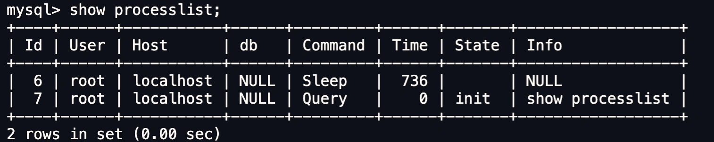

比如上图的显示结果，共有两个用户名为 root 的用户连接了 MySQL 服务，其中 id 为 6 的用户的 Command 列的状态为 `Sleep` ，这意味着该用户连接完 MySQL 服务就没有再执行过任何命令，也就是说这是一个空闲的连接，并且空闲的时长是 736 秒（ Time 列）。

> 空闲连接会一直占用着吗？

当然不是了，MySQL 定义了空闲连接的最大空闲时长，由 `wait_timeout` 参数控制的，默认值是 8 小时（28880秒），如果空闲连接超过了这个时间，连接器就会自动将它断开。

```
mysql> show variables like 'wait_timeout';
+---------------+-------+
| Variable_name | Value |
+---------------+-------+
| wait_timeout  | 28800 |
+---------------+-------+
1 row in set (0.00 sec)
```

当然，我们自己也可以手动断开空闲的连接，使用的是 kill connection + id 的命令。

```
mysql> kill connection +6;
Query OK, 0 rows affected (0.00 sec)
```

一个处于空闲状态的连接被服务端主动断开后，这个客户端并不会马上知道，等到客户端在发起下一个请求的时候，才会收到这样的报错“ERROR 2013 (HY000): Lost connection to MySQL server during query”。

> MySQL 的连接数有限制吗？

MySQL 服务支持的最大连接数由 max_connections 参数控制，比如我的 MySQL 服务默认是 151 个,超过这个值，系统就会拒绝接下来的连接请求，并报错提示“Too many connections”。

```
mysql> show variables like 'max_connections';
+-----------------+-------+
| Variable_name   | Value |
+-----------------+-------+
| max_connections | 151   |
+-----------------+-------+
1 row in set (0.00 sec)
```

MySQL 的连接也跟 HTTP 一样，有短连接和长连接的概念，它们的区别如下：

```
// 短连接
连接 mysql 服务（TCP 三次握手）
执行sql
断开 mysql 服务（TCP 四次挥手）

// 长连接
连接 mysql 服务（TCP 三次握手）
执行sql
执行sql
执行sql
....
断开 mysql 服务（TCP 四次挥手）
```

可以看到，使用长连接的好处就是可以减少建立连接和断开连接的过程，所以一般是推荐使用长连接。

但是，使用长连接后可能会占用内存增多，因为 MySQL 在执行查询过程中临时使用内存管理连接对象，这些连接对象资源只有在连接断开时才会释放。如果长连接累计很多，将导致 MySQL 服务占用内存太大，有可能会被系统强制杀掉，这样会发生 MySQL 服务异常重启的现象。

> 怎么解决长连接占用内存的问题？

有两种解决方式。

第一种，**定期断开长连接**。既然断开连接后就会释放连接占用的内存资源，那么我们可以定期断开长连接。

第二种，**客户端主动重置连接**。MySQL 5.7 版本实现了 `mysql_reset_connection()` 函数的接口，注意这是接口函数不是命令，那么当客户端执行了一个很大的操作后，在代码里调用 mysql_reset_connection 函数来重置连接，达到释放内存的效果。这个过程不需要重连和重新做权限验证，但是会将连接恢复到刚刚创建完时的状态。

至此，连接器的工作做完了，简单总结一下：

- 与客户端进行 TCP 三次握手建立连接；
- 校验客户端的用户名和密码，如果用户名或密码不对，则会报错；
- 如果用户名和密码都对了，会读取该用户的权限，然后后面的权限逻辑判断都基于此时读取到的权限；

### 1.2 查询缓存

连接器得工作完成后，客户端就可以向 MySQL 服务发送 SQL 语句了，MySQL 服务收到 SQL 语句后，就会解析出 SQL 语句的第一个字段，看看是什么类型的语句。

如果 SQL 是查询语句（select 语句），MySQL 就会先去查询缓存（ Query Cache ）里查找缓存数据，看看之前有没有执行过这一条命令，这个查询缓存是以 key-value 形式保存在内存中的，key 为 SQL 查询语句，value 为 SQL 语句查询的结果。

如果查询的语句命中查询缓存，那么就会直接返回 value 给客户端。如果查询的语句没有命中查询缓存中，那么就要往下继续执行，等执行完后，查询的结果就会被存入查询缓存中。

这么看，查询缓存还挺有用，但是其实**查询缓存挺鸡肋**的。

对于更新比较频繁的表，查询缓存的命中率很低的，因为只要一个表有更新操作，那么这个表的查询缓存就会被清空。如果刚缓存了一个查询结果很大的数据，还没被使用的时候，刚好这个表有更新操作，查询缓冲就被清空了，相当于缓存了个寂寞。

所以，MySQL 8.0 版本直接将查询缓存删掉了，也就是说 MySQL 8.0 开始，执行一条 SQL 查询语句，不会再走到查询缓存这个阶段了。

对于 MySQL 8.0 之前的版本，如果想关闭查询缓存，我们可以通过将参数 query_cache_type 设置成 DEMAND。

### 1.3 解析 SQL

在正式执行 SQL 查询语句之前， MySQL 会先对 SQL 语句做解析，这个工作交由「解析器」来完成。

**解析器**

解析器会做如下两件事情。

第一件事情，**词法分析**。MySQL 会根据你输入的字符串识别出关键字出来，例如，SQL语句 select username from userinfo，在分析之后，会得到4个Token，其中有2个Keyword，分别为select和from：

|关键字|非关键字|关键字|非关键字|
|---|---|---|---|
|select|username|from|userinfo|

第二件事情，**语法分析**。根据词法分析的结果，语法解析器会根据语法规则，判断你输入的这个 SQL 语句是否满足 MySQL 语法，如果没问题就会构建出 SQL 语法树，这样方便后面模块获取 SQL 类型、表名、字段名、 where 条件等等。

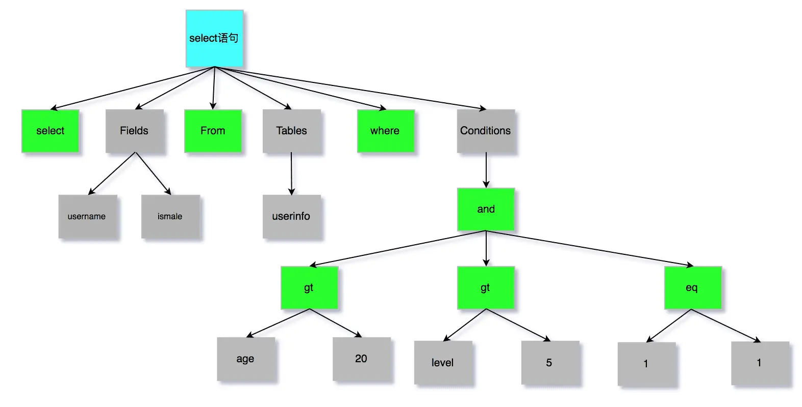

### 1.4 执行 SQL

经过解析器后，接着就要进入执行 SQL 查询语句的流程了，每条`SELECT` 查询语句流程主要可以分为下面这三个阶段：

- prepare 阶段，也就是预处理阶段；
- optimize 阶段，也就是优化阶段；
- execute 阶段，也就是执行阶段；

#### 1.4.1 预处理器

- 检查 SQL 查询语句中的表或者字段是否存在；
- 将 `select *` 中的 `*` 符号，扩展为表上的所有列；

我下面这条查询语句，test 这张表是不存在的，这时 MySQL 就会在执行 SQL 查询语句的 prepare 阶段中报错。

```
mysql> select * from test;
ERROR 1146 (42S02): Table 'mysql.test' doesn't exist
```


#### 1.4.2 优化器

经过预处理阶段后，还需要为 SQL 查询语句先制定一个执行计划，这个工作交由「优化器」来完成的。

**优化器主要负责将 SQL 查询语句的执行方案确定下来**，比如在表里面有多个索引的时候，优化器会基于查询成本的考虑，来决定选择使用哪个索引。

当然，我们本次的查询语句（select * from product where id = 1）很简单，就是选择使用主键索引。

要想知道优化器选择了哪个索引，我们可以在查询语句最前面加个 `explain` 命令，这样就会输出这条 SQL 语句的执行计划，然后执行计划中的 key 就表示执行过程中使用了哪个索引，比如下图的 key 为 `PRIMARY` 就是使用了主键索引。

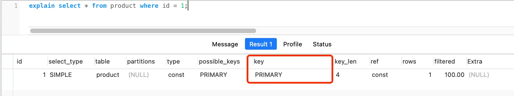

如果查询语句的执行计划里的 key 为 null 说明没有使用索引，那就会全表扫描（type = ALL），这种查询扫描的方式是效率最低档次的，如下图：

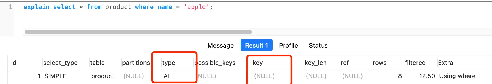

这张 product 表只有一个索引就是主键，现在我在表中将 name 设置为普通索引（二级索引）。

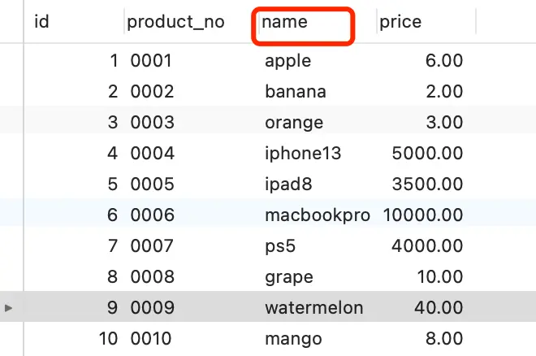

这时 product 表就有主键索引（id）和普通索引（name）。假设执行了这条查询语句：

```
select id from product where id > 1  and name like 'i%';
```

这条查询语句的结果既可以使用主键索引，也可以使用普通索引，但是执行的效率会不同。这时，就需要优化器来决定使用哪个索引了。

很显然这条查询语句是**覆盖索引**，直接在二级索引就能查找到结果（因为二级索引的 B+ 树的叶子节点的数据存储的是主键值），就没必要在主键索引查找了，因为查询主键索引的 B+ 树的成本会比查询二级索引的 B+ 的成本大，优化器基于查询成本的考虑，会选择查询代价小的普通索引。

在下图中执行计划，我们可以看到，执行过程中使用了普通索引（name），Exta 为 Using index，这就是表明使用了覆盖索引优化。

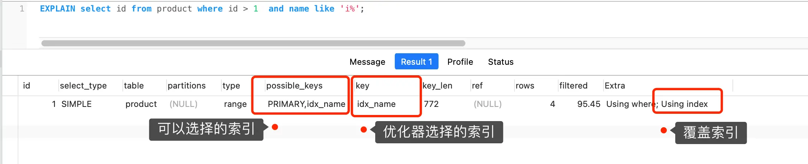

#### 1.4.3 执行器

经历完优化器后，就确定了执行方案，接下来 MySQL 就真正开始执行语句了，这个工作是由「执行器」完成的。在执行的过程中，执行器就会和存储引擎交互了，交互是以记录为单位的。

接下来，用三种方式执行过程，跟大家说一下执行器和存储引擎的交互过程（PS ：为了写好这一部分，特地去看 MySQL 源码，也是第一次看哈哈）。

- 主键索引查询
- 全表扫描
- 索引下推

**主键索引查询**

以本文开头查询语句为例，看看执行器是怎么工作的。

```
select * from product where id = 1;
```

这条查询语句的查询条件用到了主键索引，而且是等值查询，同时主键 id 是唯一，不会有 id 相同的记录，所以优化器决定选用访问类型为 const 进行查询，也就是使用主键索引查询一条记录，那么执行器与存储引擎的执行流程是这样的：

- 执行器第一次查询，会调用 read_first_record 函数指针指向的函数，因为优化器选择的访问类型为 const，这个函数指针被指向为 InnoDB 引擎索引查询的接口，把条件 `id = 1` 交给存储引擎，**让存储引擎定位符合条件的第一条记录**。
- 存储引擎通过主键索引的 B+ 树结构定位到 id = 1的第一条记录，如果记录是不存在的，就会向执行器上报记录找不到的错误，然后查询结束。如果记录是存在的，就会将记录返回给执行器；
- 执行器从存储引擎读到记录后，接着判断记录是否符合查询条件，如果符合则发送给客户端，如果不符合则跳过该记录。
- 执行器查询的过程是一个 while 循环，所以还会再查一次，但是这次因为不是第一次查询了，所以会调用 read_record 函数指针指向的函数，因为优化器选择的访问类型为 const，这个函数指针被指向为一个永远返回 - 1 的函数，所以当调用该函数的时候，执行器就退出循环，也就是结束查询了。

至此，这个语句就执行完成了。

**全表扫描**

举个全表扫描的例子：

```
select * from product where name = 'iphone';
```

这条查询语句的查询条件没有用到索引，所以优化器决定选用访问类型为 ALL 进行查询，也就是全表扫描的方式查询，那么这时执行器与存储引擎的执行流程是这样的：

- 执行器第一次查询，会调用 read_first_record 函数指针指向的函数，因为优化器选择的访问类型为 all，这个函数指针被指向为 InnoDB 引擎全扫描的接口，**让存储引擎读取表中的第一条记录**；
- 执行器会判断读到的这条记录的 name 是不是 iphone，如果不是则跳过；如果是则将记录发给客户的（是的没错，Server 层每从存储引擎读到一条记录就会发送给客户端，之所以客户端显示的时候是直接显示所有记录的，是因为客户端是等查询语句查询完成后，才会显示出所有的记录）。
- 执行器查询的过程是一个 while 循环，所以还会再查一次，会调用 read_record 函数指针指向的函数，因为优化器选择的访问类型为 all，read_record 函数指针指向的还是 InnoDB 引擎全扫描的接口，所以接着向存储引擎层要求继续读刚才那条记录的下一条记录，存储引擎把下一条记录取出后就将其返回给执行器（Server层），执行器继续判断条件，不符合查询条件即跳过该记录，否则发送到客户端；
- 一直重复上述过程，直到存储引擎把表中的所有记录读完，然后向执行器（Server层） 返回了读取完毕的信息；
- 执行器收到存储引擎报告的查询完毕的信息，退出循环，停止查询。

至此，这个语句就执行完成了。

**索引下推**

在这部分非常适合讲索引下推（MySQL 5.6 推出的查询优化策略），这样大家能清楚的知道，「下推」这个动作，下推到了哪里。

索引下推能够减少**二级索引**在查询时的回表操作，提高查询的效率，因为它将 Server 层部分负责的事情，交给存储引擎层去处理了。

举一个具体的例子，方便大家理解，这里一张用户表如下，我对 age 和 reward 字段建立了联合索引（age，reward）：

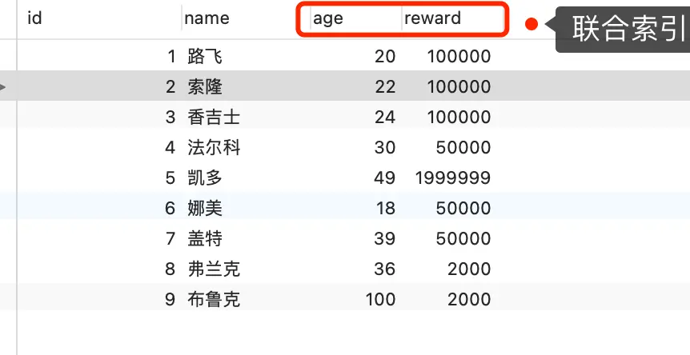

现在有下面这条查询语句：

```
select * from t_user  where age > 20 and reward = 100000;
```

联合索引当遇到范围查询 (>、<) 就会停止匹配，也就是 **age 字段能用到联合索引，但是 reward 字段则无法利用到索引**。具体原因这里可以看这篇：[索引常见面试题(opens new window)](https://xiaolincoding.com/mysql/index/index_interview.html#%E6%8C%89%E5%AD%97%E6%AE%B5%E4%B8%AA%E6%95%B0%E5%88%86%E7%B1%BB)

那么，不使用索引下推（MySQL 5.6 之前的版本）时，执行器与存储引擎的执行流程是这样的：

- Server 层首先调用存储引擎的接口定位到满足查询条件的第一条二级索引记录，也就是定位到 age > 20 的第一条记录；
- 存储引擎根据二级索引的 B+ 树快速定位到这条记录后，获取主键值，然后**进行回表操作**，将完整的记录返回给 Server 层；
- Server 层在判断该记录的 reward 是否等于 100000，如果成立则将其发送给客户端；否则跳过该记录；
- 接着，继续向存储引擎索要下一条记录，存储引擎在二级索引定位到记录后，获取主键值，然后回表操作，将完整的记录返回给 Server 层；
- 如此往复，直到存储引擎把表中的所有记录读完。

可以看到，没有索引下推的时候，每查询到一条二级索引记录，都要进行回表操作，然后将记录返回给 Server，接着 Server 再判断该记录的 reward 是否等于 100000。

而使用索引下推后，判断记录的 reward 是否等于 100000 的工作交给了存储引擎层，过程如下 ：

- Server 层首先调用存储引擎的接口定位到满足查询条件的第一条二级索引记录，也就是定位到 age > 20 的第一条记录；
- 存储引擎定位到二级索引后，**先不执行回表**操作，而是先判断一下该索引中包含的列（reward列）的条件（reward 是否等于 100000）是否成立。如果**条件不成立**，则直接**跳过该二级索引**。如果**成立**，则**执行回表**操作，将完成记录返回给 Server 层。
- Server 层在判断其他的查询条件（本次查询没有其他条件）是否成立，如果成立则将其发送给客户端；否则跳过该记录，然后向存储引擎索要下一条记录。
- 如此往复，直到存储引擎把表中的所有记录读完。

可以看到，使用了索引下推后，虽然 reward 列无法使用到联合索引，但是因为它包含在联合索引（age，reward）里，所以直接在存储引擎过滤出满足 reward = 100000 的记录后，才去执行回表操作获取整个记录。相比于没有使用索引下推，节省了很多回表操作。

当你发现执行计划里的 Extr 部分显示了 “Using index condition”，说明使用了索引下推。

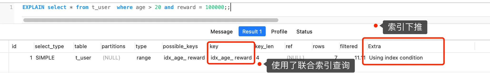

## 2.MySQL 记录存储

### 2.1 MySQL 的数据存放

大家都知道 MySQL 的数据都是保存在磁盘的，那具体是保存在哪个文件呢？

MySQL 存储的行为是由存储引擎实现的，MySQL 支持多种存储引擎，不同的存储引擎保存的文件自然也不同。

InnoDB 是我们常用的存储引擎，也是 MySQL 默认的存储引擎。所以，本文主要以 InnoDB 存储引擎展开讨论。

先来看看 MySQL 数据库的文件存放在哪个目录？

```shell
mysql> SHOW VARIABLES LIKE 'datadir';
+---------------+-----------------+
| Variable_name | Value           |
+---------------+-----------------+
| datadir       | /var/lib/mysql/ |
+---------------+-----------------+
1 row in set (0.00 sec)
```

我们每创建一个 database（数据库） 都会在 /var/lib/mysql/ 目录里面创建一个以 database 为名的目录，然后保存表结构和表数据的文件都会存放在这个目录里。

比如，这里有一个名为 my_test 的 database，该 database 里有一张名为 t_order 数据库表。


然后，我们进入 /var/lib/mysql/my_test 目录，看看里面有什么文件？

```shell
[root@ ~]#ls /var/lib/mysql/my_test
db.opt  
t_order.frm  
t_order.ibd
```

可以看到，共有三个文件，这三个文件分别代表着：

- db.opt，用来存储当前数据库的默认字符集和字符校验规则。
- t_order.frm ，t_order 的**表结构**会保存在这个文件。在 MySQL 中建立一张表都会生成一个.frm 文件，该文件是用来保存每个表的元数据信息的，主要包含表结构定义。
- t_order.ibd，t_order 的**表数据**会保存在这个文件。表数据既可以存在共享表空间文件（文件名：ibdata1）里，也可以存放在独占表空间文件（文件名：表名字.ibd）。这个行为是由参数 innodb_file_per_table 控制的，若设置了参数 innodb_file_per_table 为 1，则会将存储的数据、索引等信息单独存储在一个独占表空间，从 MySQL 5.6.6 版本开始，它的默认值就是 1 了，因此从这个版本之后， MySQL 中每一张表的数据都存放在一个独立的 .ibd 文件。

好了，现在我们知道了一张数据库表的数据是保存在「 表名字.ibd 」的文件里的，这个文件也称为独占表空间文件。

### 2.2 表空间文件的结构

**表空间由段（segment）、区（extent）、页（page）、行（row）组成**，InnoDB存储引擎的逻辑存储结构大致如下图：

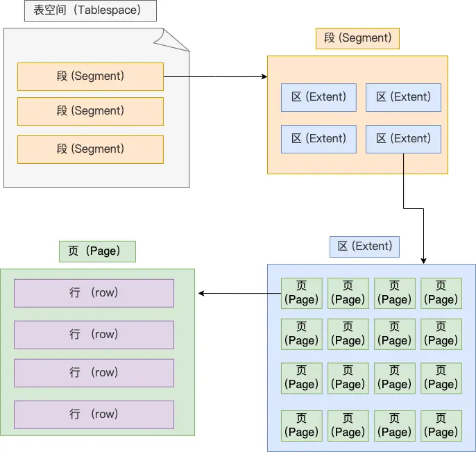

下面我们从下往上一个个看看。

#### 2.2.1 行（row）

数据库表中的记录都是按行（row）进行存放的，每行记录根据不同的行格式，有不同的存储结构。

后面我们详细介绍 InnoDB 存储引擎的行格式，也是本文重点介绍的内容。

#### 2.2.2 页（page）

记录是按照行来存储的，但是数据库的读取并不以「行」为单位，否则一次读取（也就是一次 I/O 操作）只能处理一行数据，效率会非常低。

因此，**InnoDB 的数据是按「页」为单位来读写的**，也就是说，当需要读一条记录的时候，并不是将这个行记录从磁盘读出来，而是以页为单位，将其整体读入内存。

**默认每个页的大小为 16KB**，也就是最多能保证 16KB 的连续存储空间。

页是 InnoDB 存储引擎磁盘管理的最小单元，意味着数据库每次读写都是以 16KB 为单位的，一次最少从磁盘中读取 16K 的内容到内存中，一次最少把内存中的 16K 内容刷新到磁盘中。

页的类型有很多，常见的有数据页、undo 日志页、溢出页等等。数据表中的行记录是用「数据页」来管理的。

总之知道表中的记录存储在「数据页」里面就行。

#### 2.2.3 区（extent）

我们知道 InnoDB 存储引擎是用 B+ 树来组织数据的。

B+ 树中每一层都是通过双向链表连接起来的，如果是以页为单位来分配存储空间，那么链表中相邻的两个页之间的物理位置并不是连续的，可能离得非常远，那么磁盘查询时就会有大量的随机I/O，随机 I/O 是非常慢的。

解决这个问题也很简单，就是让链表中相邻的页的物理位置也相邻，这样就可以使用顺序 I/O 了，那么在范围查询（扫描叶子节点）的时候性能就会很高。

那具体怎么解决呢？

**在表中数据量大的时候，为某个索引分配空间的时候就不再按照页为单位分配了，而是按照区（extent）为单位分配。每个区的大小为 1MB，对于 16KB 的页来说，连续的 64 个页会被划为一个区，这样就使得链表中相邻的页的物理位置也相邻，就能使用顺序 I/O 了**。

#### 2.2.4 段（segment）

表空间是由各个段（segment）组成的，段是由多个区（extent）组成的。段一般分为数据段、索引段和回滚段等。

- 索引段：存放 B + 树的非叶子节点的区的集合；
- 数据段：存放 B + 树的叶子节点的区的集合；
- 回滚段：存放的是回滚数据的区的集合，MVCC 利用了回滚段实现了多版本查询数据。

好了，终于说完表空间的结构了。接下来，就具体讲一下 InnoDB 的行格式了。

之所以要绕一大圈才讲行记录的格式，主要是想让大家知道行记录是存储在哪个文件，以及行记录在这个表空间文件中的哪个区域，有一个从上往下切入的视角，这样理解起来不会觉得很抽象。

### 2.3 InnoDB 行格式

行格式（row_format），就是一条记录的存储结构。

InnoDB 提供了 4 种行格式，分别是 Redundant、Compact、Dynamic和 Compressed 行格式。

- Redundant 是很古老的行格式了， MySQL 5.0 版本之前用的行格式，现在基本没人用了。
- 由于 Redundant 不是一种紧凑的行格式，所以 MySQL 5.0 之后引入了 Compact 行记录存储方式，Compact 是一种紧凑的行格式，设计的初衷就是为了让一个数据页中可以存放更多的行记录，从 MySQL 5.1 版本之后，行格式默认设置成 Compact。
- Dynamic 和 Compressed 两个都是紧凑的行格式，它们的行格式都和 Compact 差不多，因为都是基于 Compact 改进一点东西。从 MySQL5.7 版本之后，默认使用 Dynamic 行格式。

Redundant 行格式我这里就不讲了，因为现在基本没人用了，这次重点介绍 Compact 行格式，因为 Dynamic 和 Compressed 这两个行格式跟 Compact 非常像。

### 2.4 COMPACT 行格式

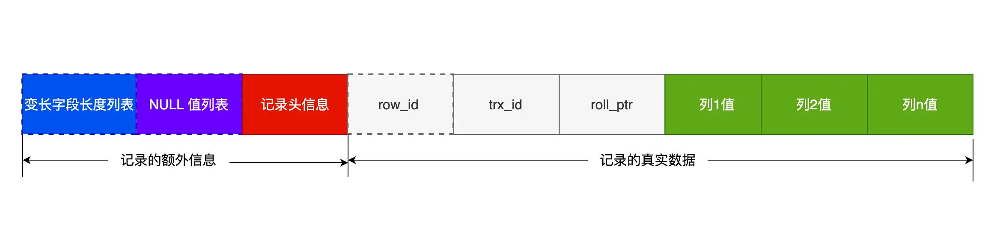

可以看到，一条完整的记录分为「记录的额外信息」和「记录的真实数据」两个部分。

接下里，分别详细说下。

#### 2.4.1 记录的额外信息

记录的额外信息包含 3 个部分：变长字段长度列表、NULL 值列表、记录头信息。

**1.变长字段长度列表**

varchar(n) 和 char(n) 的区别是什么，相信大家都非常清楚，char 是定长的，varchar 是变长的，变长字段实际存储的数据的长度（大小）不固定的。

所以，在存储数据的时候，也要把数据占用的大小存起来，存到「变长字段长度列表」里面，读取数据的时候才能根据这个「变长字段长度列表」去读取对应长度的数据。其他 TEXT、BLOB 等变长字段也是这么实现的。

为了展示「变长字段长度列表」具体是怎么保存「变长字段的真实数据占用的字节数」，我们先创建这样一张表，字符集是 ascii（所以每一个字符占用的 1 字节），行格式是 Compact，t_user 表中 name 和 phone 字段都是变长字段：

```
CREATE TABLE `t_user` (
  `id` int(11) NOT NULL,
  `name` VARCHAR(20) DEFAULT NULL,
  `phone` VARCHAR(20) DEFAULT NULL,
  `age` int(11) DEFAULT NULL,
  PRIMARY KEY (`id`) USING BTREE
) ENGINE = InnoDB DEFAULT CHARACTER SET = ascii ROW_FORMAT = COMPACT;
```

现在 t_user 表里有这三条记录：


接下来，我们看看看看这三条记录的行格式中的 「变长字段长度列表」是怎样存储的。

先来看第一条记录：

- name 列的值为 a，真实数据占用的字节数是 1 字节，十六进制 0x01；
- phone 列的值为 123，真实数据占用的字节数是 3 字节，十六进制 0x03；
- age 列和 id 列不是变长字段，所以这里不用管。

这些变长字段的真实数据占用的字节数会按照列的顺序**逆序存放**（等下会说为什么要这么设计），所以「变长字段长度列表」里的内容是「 03 01」，而不是 「01 03」。

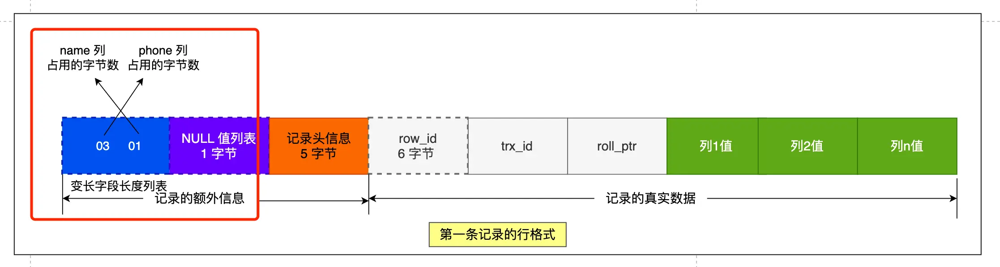

同样的道理，我们也可以得出**第二条记录**的行格式中，「变长字段长度列表」里的内容是「 04 02」，如下图：

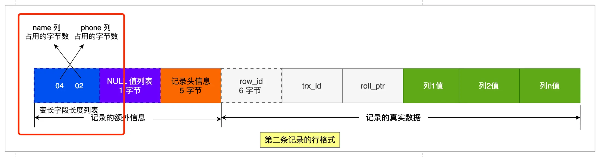

**第三条记录**中 phone 列的值是 NULL，**NULL 是不会存放在行格式中记录的真实数据部分里的**，所以「变长字段长度列表」里不需要保存值为 NULL 的变长字段的长度。

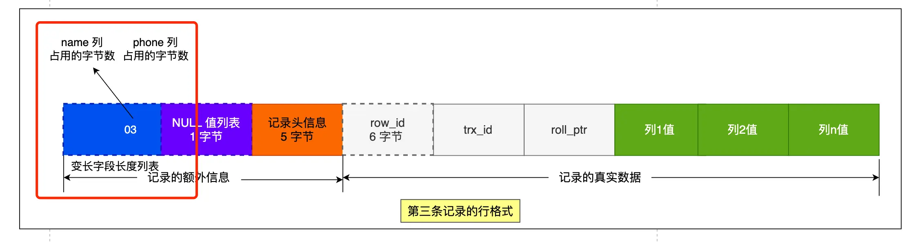

> 为什么「变长字段长度列表」的信息要按照逆序存放？

这个设计是有想法的，主要是因为「记录头信息」中指向下一个记录的指针，指向的是下一条记录的「记录头信息」和「真实数据」之间的位置，这样的好处是向左读就是记录头信息，向右读就是真实数据，比较方便。

「变长字段长度列表」中的信息之所以要逆序存放，是因为这样可以**使得位置靠前的记录的真实数据和数据对应的字段长度信息可以同时在一个 CPU Cache Line 中，这样就可以提高 CPU Cache 的命中率**。

同样的道理， NULL 值列表的信息也需要逆序存放。

> 每个数据库表的行格式都有「变长字段字节数列表」吗？

其实变长字段字节数列表不是必须的。

**当数据表没有变长字段的时候，比如全部都是 int 类型的字段，这时候表里的行格式就不会有「变长字段长度列表」了**，因为没必要，不如去掉以节省空间。

所以「变长字段长度列表」只出现在数据表有变长字段的时候。

**2.NULL 值列表**

表中的某些列可能会存储 NULL 值，如果把这些 NULL 值都放到记录的真实数据中会比较浪费空间，所以 Compact 行格式把这些值为 NULL 的列存储到 NULL值列表中。

如果存在允许 NULL 值的列，则每个列对应一个二进制位（bit），二进制位按照列的顺序逆序排列。

- 二进制位的值为`1`时，代表该列的值为NULL。
- 二进制位的值为`0`时，代表该列的值不为NULL。

另外，NULL 值列表必须用整数个字节的位表示（1字节8位），如果使用的二进制位个数不足整数个字节，则在字节的高位补 `0`。

还是以 t_user 表的这三条记录作为例子：

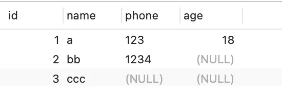

接下来，我们看看看看这三条记录的行格式中的 NULL 值列表是怎样存储的。

先来看**第一条记录**，第一条记录所有列都有值，不存在 NULL 值，所以用二进制来表示是酱紫的：

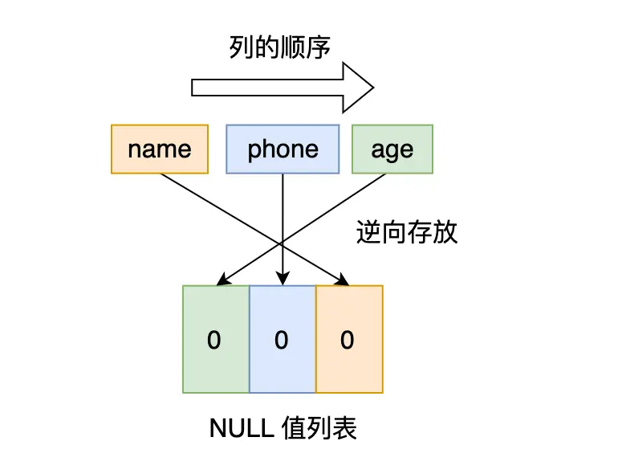

但是 InnoDB 是用整数字节的二进制位来表示 NULL 值列表的，现在不足 8 位，所以要在高位补 0，最终用二进制来表示是酱紫的：

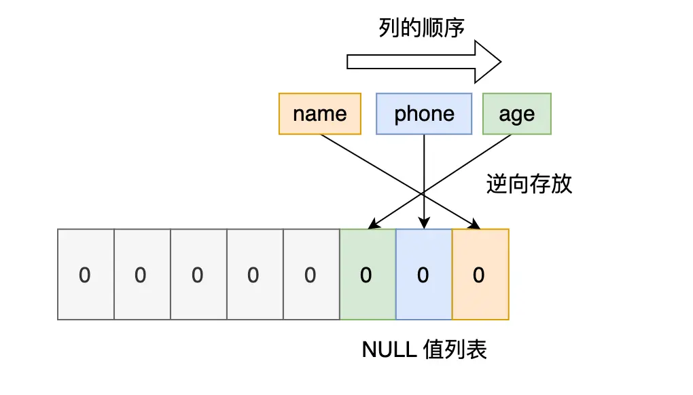

所以，对于第一条数据，NULL 值列表用十六进制表示是 0x00。

接下来看**第二条记录**，第二条记录 age 列是 NULL 值，所以，对于第二条数据，NULL值列表用十六进制表示是 0x04。

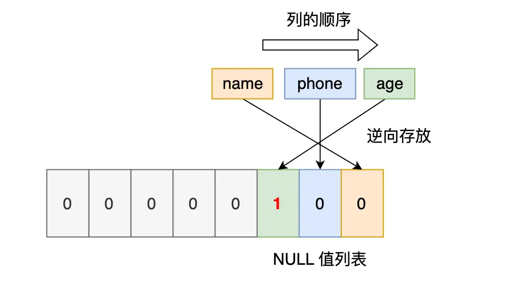

最后**第三条记录**，第三条记录 phone 列 和 age 列是 NULL 值，所以，对于第三条数据，NULL 值列表用十六进制表示是 0x06。

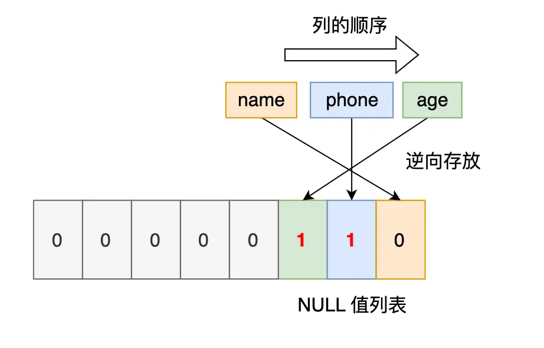

我们把三条记录的 NULL 值列表都填充完毕后，它们的行格式是这样的：

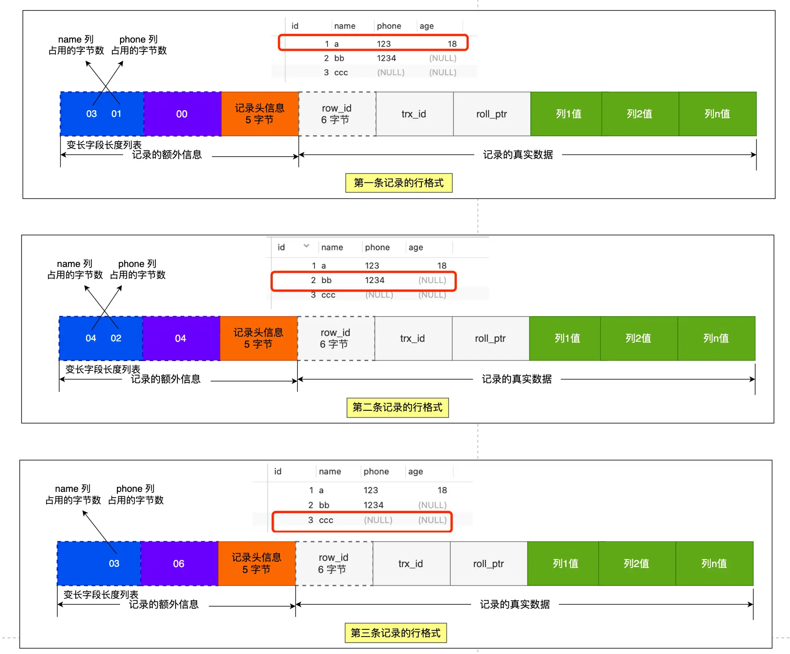

> 每个数据库表的行格式都有「NULL 值列表」吗？

NULL 值列表也不是必须的。

**当数据表的字段都定义成 NOT NULL 的时候，这时候表里的行格式就不会有 NULL 值列表了**。

所以在设计数据库表的时候，通常都是建议将字段设置为 NOT NULL，这样可以至少节省 1 字节的空间（NULL 值列表至少占用 1 字节空间）。

> 「NULL 值列表」是固定 1 字节空间吗？如果这样的话，一条记录有 9 个字段值都是 NULL，这时候怎么表示？

「NULL 值列表」的空间不是固定 1 字节的。

当一条记录有 9 个字段值都是 NULL，那么就会创建 2 字节空间的「NULL 值列表」，以此类推。

**3.记录头信息**

记录头信息中包含的内容很多，我就不一一列举了，这里说几个比较重要的：

- delete_mask ：标识此条数据是否被删除。从这里可以知道，我们执行 detele 删除记录的时候，并不会真正的删除记录，只是将这个记录的 delete_mask 标记为 1。
- next_record：下一条记录的位置。从这里可以知道，记录与记录之间是通过链表组织的。在前面我也提到了，指向的是下一条记录的「记录头信息」和「真实数据」之间的位置，这样的好处是向左读就是记录头信息，向右读就是真实数据，比较方便。
- record_type：表示当前记录的类型，0表示普通记录，1表示B+树非叶子节点记录，2表示最小记录，3表示最大记录

#### 2.4.2 记录的真实数据

记录真实数据部分除了我们定义的字段，还有三个隐藏字段，分别为：row_id、trx_id、roll_pointer，我们来看下这三个字段是什么。

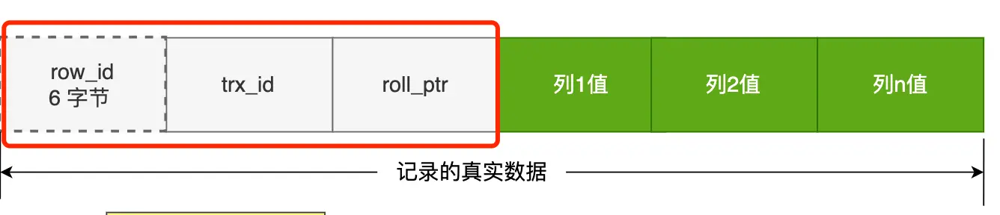

- row_id

如果我们建表的时候指定了主键或者唯一约束列，那么就没有 row_id 隐藏字段了。如果既没有指定主键，又没有唯一约束，那么 InnoDB 就会为记录添加 row_id 隐藏字段。row_id不是必需的，占用 6 个字节。

- trx_id

事务id，表示这个数据是由哪个事务生成的。 trx_id是必需的，占用 6 个字节。

- roll_pointer

这条记录上一个版本的指针。roll_pointer 是必需的，占用 7 个字节。