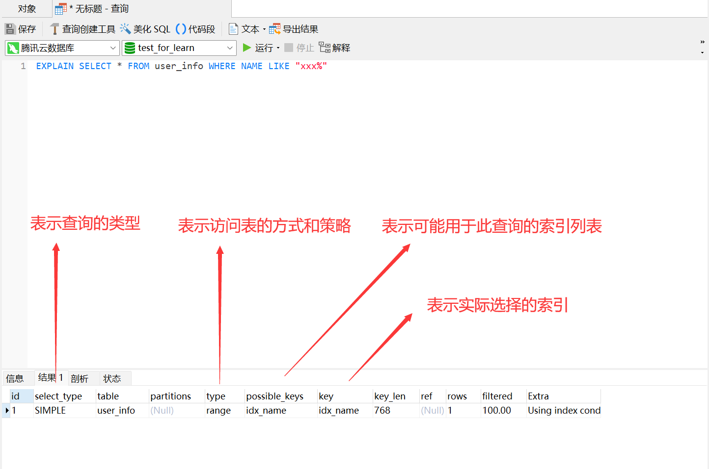
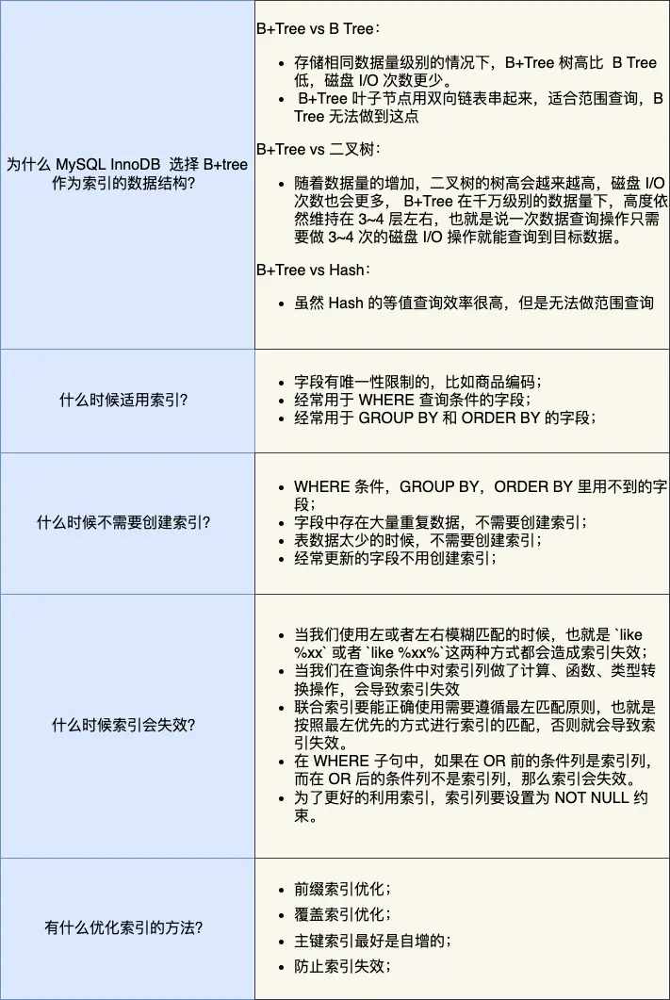

MySQL 索引

## 1.字段解释

```mysql
EXPLAIN SELECT * FROM user_info WHERE NAME LIKE "xxx%"
```



`EXPLAIN` 是 MySQL 中用于分析查询执行计划的关键字。通过执行 `EXPLAIN` 后跟随一个查询语句，您可以获取有关 MySQL 如何执行查询的信息。执行计划提供了关于查询优化器的决策，以及哪些索引和表将被访问的详细信息。

以下是 `EXPLAIN` 输出的常见字段和它们的含义：

1. `id`: 查询的唯一标识符，通常是一个数字，表示查询的执行顺序。如果查询包含子查询，每个子查询都会有一个唯一的标识符。
2. `select_type`: 表示查询的类型。可能的值包括：
    - `SIMPLE`: 简单的 `SELECT` 查询。
    - `PRIMARY`: 最外层查询。
    - `SUBQUERY`: 子查询。
    - `DERIVED`: 在 `FROM` 子句中派生的表（派生表）。
    - `UNION`: 使用 `UNION` 进行联合的查询。
    - `UNION RESULT`: `UNION` 查询的结果。
3. `table`: 表示访问的表的名称。
4. `type`: 表示访问表的方式和策略。可能的值包括：
    - `ALL`: 全表扫描。
    - `index`: 使用索引进行扫描。
    - `range`: 使用索引范围扫描。
    - `ref`: 使用非唯一索引进行查找。
    - `eq_ref`: 使用唯一索引进行查找。
    - `const`: 使用常数值查找（通常在主键或唯一索引上）。
    - `system`: 用于特定系统表的查询。
    - `NULL`: 表示没有使用表。
5. `possible_keys`: 显示可能用于此查询的索引列表。
6. `key`: 表示实际选择的索引。
7. `key_len`: 表示索引中使用的字节数。
8. `ref`: 表示用于查找的列。
9. `rows`: 表示预计要扫描的行数。这是一个估算值，表示查询的执行计划预计需要处理的行数。
10. `Extra`: 提供了关于查询执行的其他信息，例如使用的临时表、文件排序等。可能的值包括：
    - `Using where`: 使用了 `WHERE` 子句进行过滤。
    - `Using index`: 通过索引进行查找，无需访问表数据。
    - `Using temporary`: 使用了临时表进行排序。
    - `Using filesort`: 使用了文件排序。
    - `Using join buffer`: 使用了连接缓冲区。

通过分析 `EXPLAIN` 输出，您可以更好地理解查询的执行计划，识别性能瓶颈，优化查询和索引，以提高数据库查询性能。此外，了解查询执行计划还有助于调试查询问题和优化查询性能。



