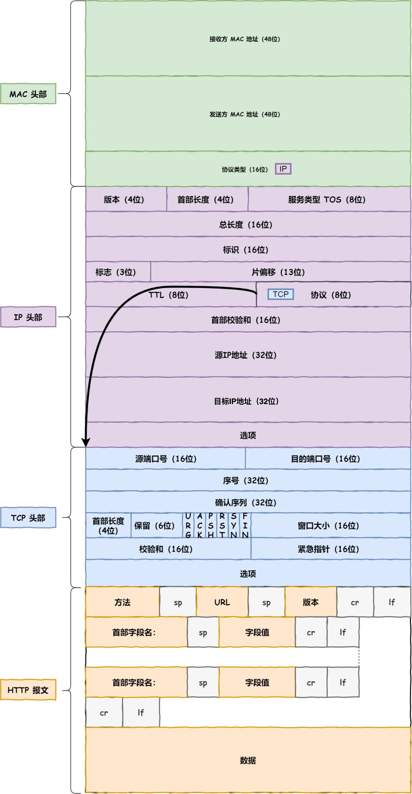

计算机网络模型的相关基础

## 1.TCP/IP 网络模型

TCP/IP 网络通常是由上到下分成 4 层，分别是**应用层，传输层，网络层和网络接口层**：

每一层的封装格式：

网络接口层的传输单位是帧（frame），IP 层的传输单位是包（packet），TCP 层的传输单位是段（segment），HTTP 的传输单位则是消息或报文（message）。但这些名词并没有什么本质的区分，可以统称为数据包。

## 2.OSI 网络模型

为了使得多种设备能通过网络相互通信，和为了解决各种不同设备在网络互联中的兼容性问题，国际标准化组织制定了开放式系统互联通信参考模型（Open System Interconnection Reference Model），也就是 OSI 网络模型，该模型主要有 7 层，分别是应用层、表示层、会话层、传输层、网络层、数据链路层以及物理层。

每一层负责的职能都不同，如下：

- 应用层，负责给应用程序提供统一的接口；
- 表示层，负责把数据转换成兼容另一个系统能识别的格式；
- 会话层，负责建立、管理和终止表示层实体之间的通信会话；
- 传输层，负责端到端的数据传输；
- 网络层，负责数据的路由、转发、分片；
- 数据链路层，负责数据的封帧和差错检测，以及 MAC 寻址；
- 物理层，负责在物理网络中传输数据帧；

TCP/IP 网络模型共有 4 层，分别是应用层、传输层、网络层和网络接口层，每一层负责的职能如下：

- 应用层，负责向用户提供一组应用程序，比如 HTTP、DNS、FTP 等;
- 传输层，负责端到端的通信，比如 TCP、UDP 等；
- 网络层，负责网络包的封装、分片、路由、转发，比如 IP、ICMP 等；
- 网络接口层，负责网络包在物理网络中的传输，比如网络包的封帧、 MAC 寻址、差错检测，以及通过网卡传输网络帧等；

网络包的报文如下图：

路由器和交换机是有区别的。

- 因为**路由器**是基于 IP 设计的，俗称**三层**网络设备，路由器的各个端口都具有 MAC 地址和 IP 地址；
- 而**交换机**是基于以太网设计的，俗称**二层**网络设备，交换机的端口不具有 MAC 地址。

## 3.Linux 网络协议栈

应用层数据在每一层的封装格式：

其中：

- 传输层，给应用数据前面增加了 TCP 头；
- 网络层，给 TCP 数据包前面增加了 IP 头；
- 网络接口层，给 IP 数据包前后分别增加了帧头和帧尾；

这些新增的头部和尾部，都有各自的作用，也都是按照特定的协议格式填充，这每一层都增加了各自的协议头，那自然网络包的大小就增大了，但物理链路并不能传输任意大小的数据包，所以在以太网中，规定了最大传输单元（MTU）是 `1500` 字节，也就是规定了单次传输的最大 IP 包大小。

当网络包超过 MTU 的大小，就会在网络层分片，以确保分片后的 IP 包不会超过 MTU 大小，如果 MTU 越小，需要的分包就越多，那么网络吞吐能力就越差，相反的，如果 MTU 越大，需要的分包就越少，那么网络吞吐能力就越好。

知道了 TCP/IP 网络模型，以及网络包的封装原理后，那么 Linux 网络协议栈的样子，你想必猜到了大概，它其实就类似于 TCP/IP 的四层结构：

从上图的的网络协议栈，可以看到：

- 应用程序需要通过系统调用，来跟 Socket 层进行数据交互；
- Socket 层的下面就是传输层、网络层和网络接口层；
- 最下面的一层，则是网卡驱动程序和硬件网卡设备；

