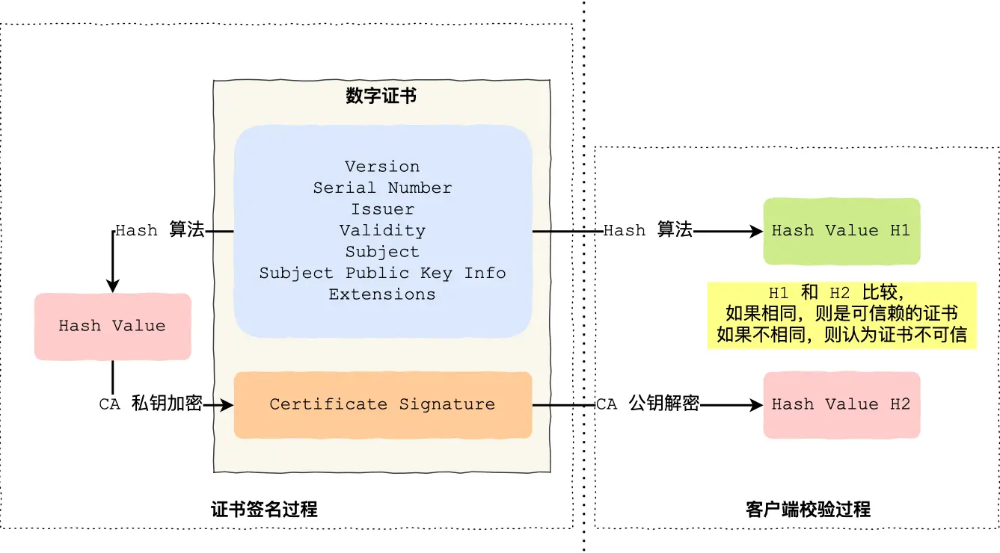
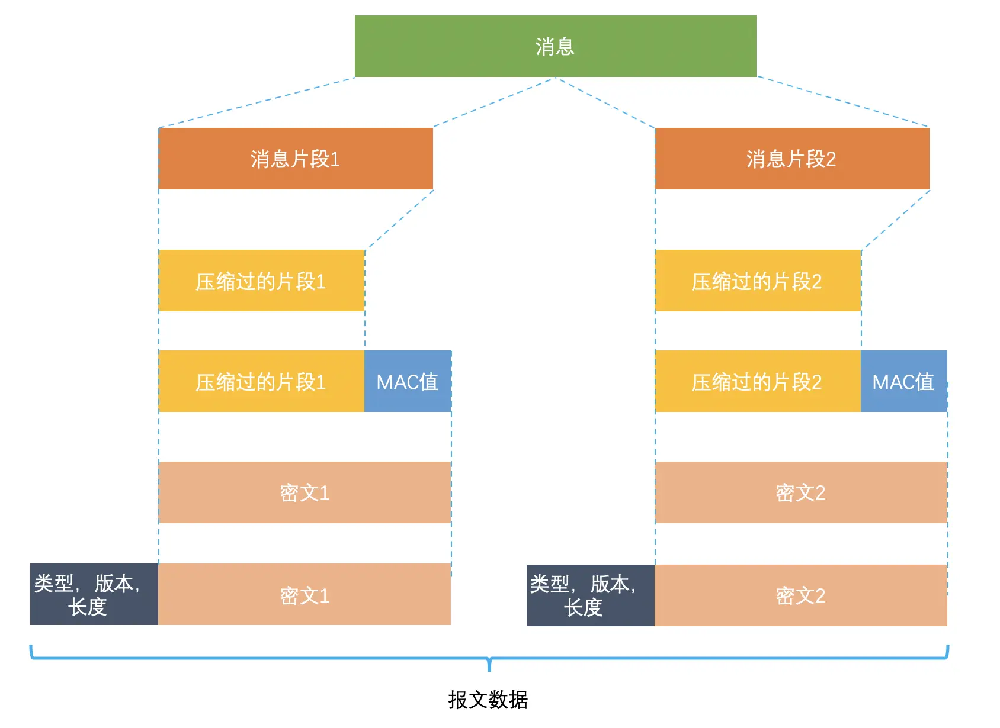
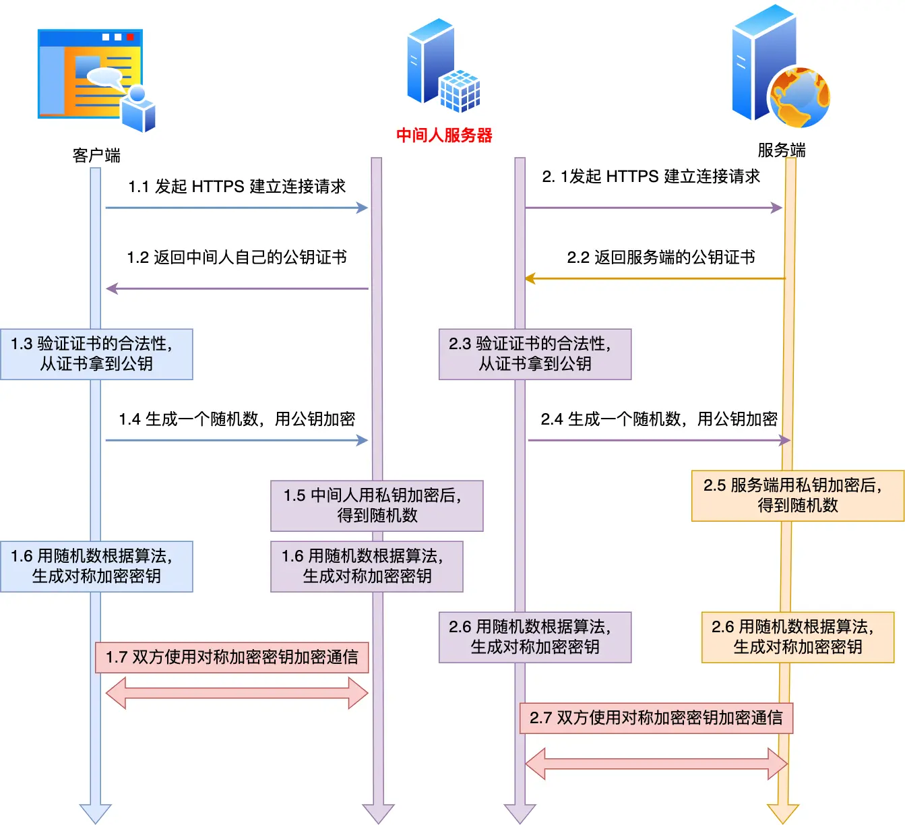
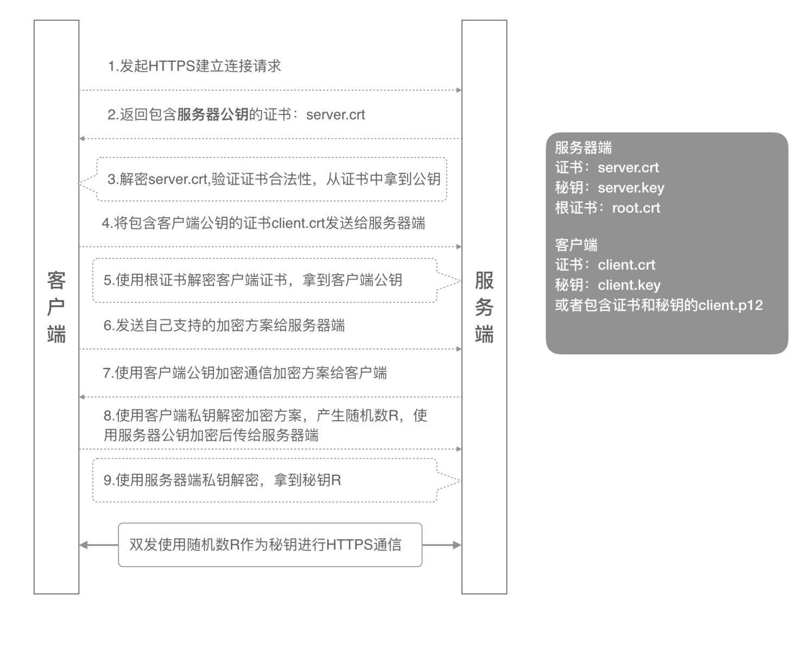

HTTP 相关技术

## 1.HTTP / 1.1

### 1.1 HTTP/1.1 的优点

HTTP 最突出的优点是「简单、灵活和易于扩展、应用广泛和跨平台」。

**1. 简单**

HTTP 基本的报文格式就是 `header + body`，头部信息也是 `key-value` 简单文本的形式，**易于理解**，降低了学习和使用的门槛。

**2. 灵活和易于扩展**

HTTP 协议里的各类请求方法、URI/URL、状态码、头字段等每个组成要求都没有被固定死，都允许开发人员**自定义和扩充**。

同时 HTTP 由于是工作在应用层（ `OSI` 第七层），则它**下层可以随意变化**，比如：

- HTTPS 就是在 HTTP 与 TCP 层之间增加了 SSL/TLS 安全传输层；
- HTTP/1.1 和 HTTP/2.0 传输协议使用的是 TCP 协议，而到了 HTTP/3.0 传输协议改用了 UDP 协议。

**3. 应用广泛和跨平台**

互联网发展至今，HTTP 的应用范围非常的广泛，从台式机的浏览器到手机上的各种 APP，从看新闻、刷贴吧到购物、理财、吃鸡，HTTP 的应用遍地开花，同时天然具有**跨平台**的优越性。

### 1.2 HTTP/1.1 的缺点

HTTP 协议里有优缺点一体的**双刃剑**，分别是「无状态、明文传输」，同时还有一大缺点「不安全」。

**1. 无状态**

无状态的**好处**，因为服务器不会去记忆 HTTP 的状态，所以不需要额外的资源来记录状态信息，这能减轻服务器的负担，能够把更多的 CPU 和内存用来对外提供服务。

无状态的**坏处**，既然服务器没有记忆能力，它在完成有关联性的操作时会非常麻烦。

对于无状态的问题，**解法方案有很多种，其中比较简单的方式用 Cookie 技术**。

`Cookie` 通过在请求和响应报文中写入 Cookie 信息来控制客户端的状态。

相当于，**在客户端第一次请求后，服务器会下发一个装有客户信息的「小贴纸」，后续客户端请求服务器的时候，带上「小贴纸」，服务器就能认得了了。**

**2. 明文传输**

明文意味着在传输过程中的信息，是可方便阅读的，比如 Wireshark 抓包都可以直接肉眼查看，为我们调试工作带了极大的便利性。

但是这正是这样，HTTP 的所有信息都容易被窃取。

**3. 不安全**

HTTP 比较严重的缺点就是不安全：

- 通信使用明文（不加密），内容可能会被窃听。
- 不验证通信方的身份，因此有可能遭遇伪装。
- 无法证明报文的完整性，所以有可能已遭篡改。

HTTP 的安全问题，可以用 HTTPS 的方式解决，也就是通过引入 SSL/TLS 层，使得在安全上达到了极致。

### 1.3 HTTP/1.1 的性能

HTTP 协议是基于 **TCP/IP**，并且使用了「**请求 - 应答**」的通信模式，所以性能的关键就在这**两点**里。

**1. 长连接**

早期 HTTP/1.0 性能上的一个很大的问题，那就是每发起一个请求，都要新建一次 TCP 连接（三次握手），而且是串行请求，做了无谓的 TCP 连接建立和断开，增加了通信开销。

为了解决上述 TCP 连接问题，HTTP/1.1 提出了**长连接**的通信方式，也叫持久连接。这种方式的好处在于减少了 TCP 连接的重复建立和断开所造成的额外开销，减轻了服务器端的负载。

持久连接的特点是，只要任意一端没有明确提出断开连接，则保持 TCP 连接状态。

当然，如果某个 HTTP 长连接超过一定时间没有任何数据交互，服务端就会主动断开这个连接。

**2. 管道网络传输**

HTTP/1.1 采用了长连接的方式，这使得管道（pipeline）网络传输成为了可能。

即可在同一个 TCP 连接里面，客户端可以发起多个请求，只要第一个请求发出去了，不必等其回来，就可以发第二个请求出去，可以**减少整体的响应时间。**

举例来说，客户端需要请求两个资源。以前的做法是，在同一个 TCP 连接里面，先发送 A 请求，然后等待服务器做出回应，收到后再发出 B 请求。那么，管道机制则是允许浏览器同时发出 A 请求和 B 请求。

但是**服务器必须按照接收请求的顺序发送对这些管道化请求的响应**。

如果服务端在处理 A 请求时耗时比较长，那么后续的请求的处理都会被阻塞住，这称为「队头堵塞」。

所以，**HTTP/1.1 管道解决了请求的队头阻塞，但是没有解决响应的队头阻塞**。

**3. 队头阻塞**

「请求 - 应答」的模式会造成 HTTP 的性能问题。

因为当顺序发送的请求序列中的一个请求因为某种原因被阻塞时，在后面排队的所有请求也一同被阻塞了，会招致客户端一直请求不到数据，这也就是「**队头阻塞**」，好比上班的路上塞车。

总之 HTTP/1.1 的性能一般般，后续的 HTTP/2 和 HTTP/3 就是在优化 HTTP 的性能。

## 2.HTTP 与 HTTPS

### 2.1 HTTP 与 HTTPS 区别

- HTTP 是超文本传输协议，信息是明文传输，存在安全风险的问题。HTTPS 则解决 HTTP 不安全的缺陷，在 TCP 和 HTTP 网络层之间加入了 SSL/TLS 安全协议，使得报文能够加密传输。
- HTTP 连接建立相对简单， TCP 三次握手之后便可进行 HTTP 的报文传输。而 HTTPS 在 TCP 三次握手之后，还需进行 SSL/TLS 的握手过程，才可进入加密报文传输。
- 两者的默认端口不一样，**HTTP 默认端口号是 80**，**HTTPS 默认端口号是 443**。
- HTTPS 协议需要向 CA（证书权威机构）申请数字证书，来保证服务器的身份是可信的。

### 2.2 HTTPS 解决了 HTTP 的哪些问题

- **窃听风险**，比如通信链路上可以获取通信内容。
- **篡改风险**，比如强制植入垃圾广告，视觉污染。
- **冒充风险**，比如冒充淘宝网站。

HTTP**S** 在 HTTP 与 TCP 层之间加入了 `SSL/TLS` 协议，可以很好的解决了上述的风险：

- **信息加密**：交互信息无法被窃取。
- **校验机制**：无法篡改通信内容，篡改了就不能正常显示。
- **身份证书**：证明淘宝是真的淘宝网。

**HTTPS 是如何解决上面的三个风险的：**

- **混合加密**的方式实现信息的**机密性**，解决了窃听的风险。
- **摘要算法**的方式来实现**完整性**，它能够为数据生成独一无二的「指纹」，指纹用于校验数据的完整性，解决了篡改的风险。
- 将服务器公钥放入到**数字证书**中，解决了冒充的风险。

### 2.3 HTTPS 是如何建立连接（四次握手）

SSL/TLS 协议基本流程：

- 客户端向服务器索要并验证服务器的公钥。
- 双方协商生产「会话秘钥」。
- 双方采用「会话秘钥」进行加密通信。

前两步也就是 SSL/TLS 的建立过程，也就是 TLS 握手阶段。

TLS 的「握手阶段」涉及**四次**通信，使用不同的密钥交换算法，TLS 握手流程也会不一样的，现在常用的密钥交换算法有两种：**RSA** 算法 和 **ECDHE** 算法。

**TLS 协议建立的详细流程：**

**1. ClientHello**

首先，由客户端向服务器发起加密通信请求，也就是 `ClientHello` 请求。

客户端主要向服务器发送以下信息：

（1）客户端支持的 TLS 协议版本，如 TLS 1.2 版本。

（2）客户端生产的随机数（`Client Random`），后面用于生成「会话秘钥」条件之一。

（3）客户端支持的密码套件列表，如 RSA 加密算法。

**2. SeverHello**

服务器收到客户端请求后，向客户端发出响应，也就是 `SeverHello`。服务器回应的内容有如下内容：

（1）确认 TLS 协议版本，如果浏览器不支持，则关闭加密通信。

（2）服务器生产的随机数（`Server Random`），也是后面用于生产「会话秘钥」条件之一。

（3）确认的密码套件列表，如 RSA 加密算法。

（4）服务器的数字证书。

**3.客户端回应**

客户端收到服务器的回应之后，**首先通过浏览器或者操作系统中的 CA 公钥，确认服务器的数字证书的真实性。**

如果证书没有问题，客户端会**从数字证书中取出服务器的公钥**，然后使用它加密报文，向服务器发送：

（1）一个随机数（`pre-master key`）。该随机数会被服务器公钥加密。

（2）加密通信算法改变通知，表示随后的信息都将用「会话秘钥」加密通信。

（3）客户端握手结束通知，表示客户端的握手阶段已经结束。这一项同时把之前所有内容的发生的数据做个摘要，用来供服务端校验。

上面第一项的随机数是整个握手阶段的第三个随机数，会发给服务端，所以这个随机数客户端和服务端都是一样的。

**服务器和客户端有了这三个随机数（Client Random、Server Random、pre-master key），接着就用双方协商的加密算法，各自生成本次通信的「会话秘钥」**。

**4. 服务器的最后回应**

服务器收到客户端的第三个随机数（`pre-master key`）之后，通过协商的加密算法，计算出本次通信的「会话秘钥」。

然后，向客户端发送最后的信息：

（1）加密通信算法改变通知，表示随后的信息都将用「会话秘钥」加密通信。

（2）服务器握手结束通知，表示服务器的握手阶段已经结束。这一项同时把之前所有内容的发生的数据做个摘要，用来供客户端校验。

至此，整个 TLS 的握手阶段全部结束。接下来，客户端与服务器进入加密通信，就完全是使用普通的 HTTP 协议，只不过用「会话秘钥」加密内容。

### 2.4 数字证书签发和验证流程

CA 签发证书的过程：

- 首先 CA 会把持有者的公钥、用途、颁发者、有效时间等信息打成一个包，然后对这些信息进行 **Hash** 计算，得到一个 Hash 值；
- 然后 CA 会使用自己的私钥将该 Hash 值加密，生成 Certificate Signature，也就是 CA 对证书做了签名；
- 最后将 Certificate Signature 添加在文件证书上，形成数字证书；

客户端校验服务端的数字证书的过程，如上图右边部分：

- 首先客户端会**使用同样的 Hash 算法获取该证书的 Hash 值 H1**；
- **通常浏览器和操作系统中集成了 CA 的公钥信息**，**浏览器收到证书后可以使用 CA 的公钥解密 Certificate Signature 内容，得到一个 Hash 值 H2** ；
- 最后**比较 H1 和 H2**，如果值相同，则为可信赖的证书，否则则认为证书不可信。

### 2.5 HTTPS 的应用数据是如何保证完整性的

TLS 在实现上分为**握手协议**和**记录协议**两层：

- TLS 握手协议负责协商加密算法和生成对称密钥，后续用此密钥来保护应用程序数据（即 HTTP 数据）；
- TLS 记录协议负责保护应用程序数据并验证其完整性和来源，所以对 HTTP 数据加密是使用记录协议；

TLS **记录协议主要负责消息（HTTP 数据）的压缩，加密及数据的认证**，过程如下图：

具体过程如下：

- 首先，消息被分割成多个较短的片段,然后分别对每个片段进行压缩。
- 接下来，经过压缩的片段会被**加上消息认证码（MAC 值，这个是通过哈希算法生成的），这是为了保证完整性，并进行数据的认证**。通过附加消息认证码的 MAC 值，可以识别出篡改。与此同时，为了防止重放攻击，在计算消息认证码时，还加上了片段的编码。
- 再接下来，经过压缩的片段再加上消息认证码会一起通过对称密码进行加密。
- 最后，上述经过加密的数据再加上由数据类型、版本号、压缩后的长度组成的报头就是最终的报文数据。

记录协议完成后，最终的报文数据将传递到传输控制协议 (TCP) 层进行传输。

### 2.6 中间人服务器

客户端通过浏览器向服务端发起 HTTPS 请求时，被「假基站」转发到了一个「中间人服务器」，于是客户端是和「中间人服务器」完成了 TLS 握手，然后这个「中间人服务器」再与真正的服务端完成 TLS 握手。

具体过程如下：

- 客户端向服务端发起 HTTPS 建立连接请求时，然后被「假基站」转发到了一个「中间人服务器」，接着中间人向服务端发起 HTTPS 建立连接请求，此时客户端与中间人进行 TLS 握手，中间人与服务端进行 TLS 握手；
- 在客户端与中间人进行 TLS 握手过程中，中间人会发送自己的公钥证书给客户端，**客户端验证证书的真伪**，然后从证书拿到公钥，并生成一个随机数，用公钥加密随机数发送给中间人，中间人使用私钥解密，得到随机数，此时双方都有随机数，然后通过算法生成对称加密密钥（A），后续客户端与中间人通信就用这个对称加密密钥来加密数据了。
- 在中间人与服务端进行 TLS 握手过程中，服务端会发送从 CA 机构签发的公钥证书给中间人，从证书拿到公钥，并生成一个随机数，用公钥加密随机数发送给服务端，服务端使用私钥解密，得到随机数，此时双方都有随机数，然后通过算法生成对称加密密钥（B），后续中间人与服务端通信就用这个对称加密密钥来加密数据了。
- 后续的通信过程中，中间人用对称加密密钥（A）解密客户端的 HTTPS 请求的数据，然后用对称加密密钥（B）加密 HTTPS 请求后，转发给服务端，接着服务端发送 HTTPS 响应数据给中间人，中间人用对称加密密钥（B）解密 HTTPS 响应数据，然后再用对称加密密钥（A）加密后，转发给客户端。

从客户端的角度看，其实并不知道网络中存在中间人服务器这个角色。那么中间人就可以解开浏览器发起的 HTTPS 请求里的数据，也可以解开服务端响应给浏览器的 HTTPS 响应数据。相当于，中间人能够 “偷看” 浏览器与服务端之间的 HTTPS 请求和响应的数据。

但是要发生这种场景是有前提的，前提是用户点击接受了中间人服务器的证书。

中间人服务器与客户端在 TLS 握手过程中，实际上发送了自己伪造的证书给浏览器，而这个伪造的证书是能被浏览器（客户端）识别出是非法的，于是就会提醒用户该证书存在问题。

所以，**HTTPS 协议本身到目前为止还是没有任何漏洞的，即使你成功进行中间人攻击，本质上是利用了客户端的漏洞（用户点击继续访问或者被恶意导入伪造的根证书），并不是 HTTPS 不够安全**。

### 2.7 如何避免中间人攻击

> 为什么抓包工具能截取 HTTPS 数据？

很多抓包工具 之所以可以明文看到 HTTPS 数据，**工作原理与中间人一致的**。

对于 HTTPS 连接来说，中间人要满足以下两点，才能实现真正的明文代理:

1. 中间人，作为客户端与真实服务端建立连接这一步不会有问题，因为服务端不会校验客户端的身份；
2. 中间人，**作为服务端与真实客户端建立连接**，**这里会有客户端信任服务端的问题**，也就是**服务端必须有对应域名的私钥**；

中间人要拿到**私钥**只能通过如下方式：

1. 去网站服务端拿到私钥；
2. 去CA处拿域名签发私钥；
3. **自己签发证书，切要被浏览器信任**；

不用解释，**抓包工具只能使用第三种方式取得中间人的身份**。

使用抓包工具进行 HTTPS 抓包的时候，**需要在客户端安装 Fiddler 的根证书**，这里**实际上起认证中心（CA）的作用**。

抓包工具能够抓包的关键是**客户端会往系统受信任的根证书列表中导入抓包工具生成的证书**，而这个证书会被浏览器信任，也就是**抓包工具给自己创建了一个认证中心 CA，客户端拿着中间人签发的证书去中间人自己的 CA 去认证，当然认为这个证书是有效的**。

> 如何避免被中间人抓取数据？

我们要保证自己电脑的安全，不要被病毒乘虚而入，而且也不要点击任何证书非法的网站，这样 HTTPS 数据就不会被中间人截取到了。

当然，我们还可以通过 **HTTPS 双向认证**来避免这种问题。

一般我们的 HTTPS 是单向认证，客户端只会验证了服务端的身份，但是服务端并不会验证客户端的身份。

如果用了双向认证方式，不仅客户端会验证服务端的身份，而且服务端也会验证客户端的身份。服务端一旦验证到请求自己的客户端为不可信任的，服务端就拒绝继续通信，客户端如果发现服务端为不可信任的，那么也中止通信。

## 3.HTTP/1.1、HTTP/2、HTTP/3 演变

### 3.1 HTTP/1.1 相比 HTTP/1.0 提高了什么性能

HTTP/1.1 相比 HTTP/1.0 **性能上的改进**：

- 使用**长连接**的方式改善了 HTTP/1.0 **短连接造成的性能开销**。
- **支持管道**（pipeline）网络传输，只要第一个请求发出去了，不必等其回来，就可以发第二个请求出去，可以减少整体的响应时间。

但 HTTP/1.1 还是**有性能瓶颈**：

- **请求 / 响应头部（Header）未经压缩就发送**，**首部信息越多延迟越大**。只能压缩 `Body` 的部分；
- 发送冗长的首部。每次互相**发送相同的首部造成的浪费较多**；
- **服务器是按请求的顺序响应的**，如果服务器响应慢，会招致客户端一直请求不到数据，也就是**队头阻塞**；
- **没有请求优先级控制**；
- **请求只能从客户端开始，服务器只能被动响应**。

### 3.2 HTTP/2 的优化

HTTP/2 相比 HTTP/1.1 **性能上的改进**：

- **头部压缩：通过`HPACK` 算法，在客户端和服务器同时维护一张头信息表，所有字段都会存入这个表，生成一个索引号，之后就不发送同样字段了，只发送索引号，可以**提高速度。
- **二进制格式：HTTP/2 不再像 HTTP/1.1 里的纯文本形式的报文，而是全面采用了**二进制格式**，头信息和数据体都是二进制，并且统称为帧（frame）：**头信息帧（Headers Frame）和数据帧（Data Frame）**。
- **并发传输：HTTP/1.1 的实现是基于请求-响应模型的，可能会出现队头阻塞的情况，而 HTTP/2 针对不同的 HTTP 请求用**独一无二的 Stream ID 来区分，接收端可以通过 Stream ID 有序组装成 HTTP 消息，不同 Stream 的帧是可以乱序发送的，**因此可以并发不同的 Stream ，也就是 HTTP/2 可以并行交错地发送请求和响应**。
- **服务器主动推送资源：HTTP/2 还在一定程度上改善了传统的「请求 - 应答」工作模式，服务端不再是被动地响应，可以**主动**向客户端发送消息。（客户端和服务器**双方都可以建立 Stream， Stream ID 也是有区别的，客户端建立的 Stream 必须是奇数号，而服务器建立的 Stream 必须是偶数号）。

### 3.3 HTTP/3 的优化

HTTP/2 队头阻塞的问题是因为 **TCP**，所以 **HTTP/3 把 HTTP 下层的 TCP 协议改成了 UDP**，基于 UDP 的 **QUIC 协议** 可以实现类似 TCP 的可靠性传输：

- **无队头阻塞：QUIC 有自己的一套机制可以保证传输的可靠性的。当某个流发生丢包时，只会阻塞这个流，其他流不会受到影响，因此不存在队头阻塞问题。
- **更快的连接建立：HTTP/3 在传输数据前虽然需要 QUIC 协议握手，但是这个握手过程只需要 1 RTT，握手的目的是为确认双方的「连接 ID」，连接迁移就是基于连接 ID 实现的
- **连接迁移：基于 TCP 传输协议的 HTTP 协议，由于是通过四元组（源 IP、源端口、目的 IP、目的端口）确定一条 TCP 连接，所以当 IP 地址改变就需要断开连接，重新进行建立连接，而 QUIC 协议没有用四元组的方式来“绑定”连接，而是通过**连接 ID** 来标记通信的两个端点，客户端和服务器可以各自选择一组 ID 来标记自己，因此即使移动设备的网络变化后，导致 IP 地址变化了，只要仍保有上下文信息（比如连接 ID、TLS 密钥等），就可以“无缝”地复用原连接，消除重连的成本，没有丝毫卡顿感，达到了**连接迁移**的功能。

## 4.HTTP 缓存技术

### 4.1 强制缓存

指的是只要浏览器判断缓存没有过期，则直接使用浏览器的本地缓存，决定是否**使用缓存的主动性在于浏览器这边**。

- size 项中标识的是 from disk cache，就是使用了强制缓存
- `Cache-Control`， 是一个相对时间；
- `Expires`，是一个绝对时间；
- 当浏览器第一次请求访问服务器资源时，服务器会在返回这个资源的同时，在 Response 头部加上 Cache-Control，Cache-Control 中设置了过期时间大小；
- 浏览器再次请求访问服务器中的该资源时，会先**通过请求资源的时间与 Cache-Control 中设置的过期时间大小，来计算出该资源是否过期**，如果没有，则使用该缓存，否则重新请求服务器；
- 服务器再次收到请求后，会再次更新 Response 头部的 Cache-Control

### 4.2 协商缓存

某些请求的响应码是 `304`，这个是告诉浏览器可以使用本地缓存的资源，**通过服务端告知客户端**是否**可以使用缓存**的方式被称为协商缓存

协商缓存可以基于**两种头部**来实现：

第一种：请求头部中的 `If-Modified-Since` 字段与响应头部中的 `Last-Modified` 字段实现，这两个字段的意思是：

- 响应头部中的 `Last-Modified`：标示这个响应资源的**最后修改时间**；
- 请求头部中的 `If-Modified-Since`：当资源过期了，发现响应头中具有 Last-Modified 声明，则再次发起请求的时候带上 Last-Modified 的时间，服务器收到请求后发现有 If-Modified-Since 则与被请求资源的最后修改时间进行对比（Last-Modified），如果最后修改时间较新（大），说明资源又被改过，则返回最新资源，HTTP 200 OK；如果最后修改时间较旧（小），说明资源无新修改，响应 HTTP 304 走缓存。

第二种：请求头部中的 `If-None-Match` 字段与响应头部中的 `ETag` 字段：

- 响应头部中 `Etag`：**唯一标识响应资源**；
- 请求头部中的 `If-None-Match`：**当资源过期时，浏览器发现响应头里有 Etag**，则再次向服务器发起请求时，会将请求头 If-None-Match 值**设置为 Etag 的值**。服务器收到请求后进行比对，如果资源没有变化返回 304，如果资源变化了返回 200。