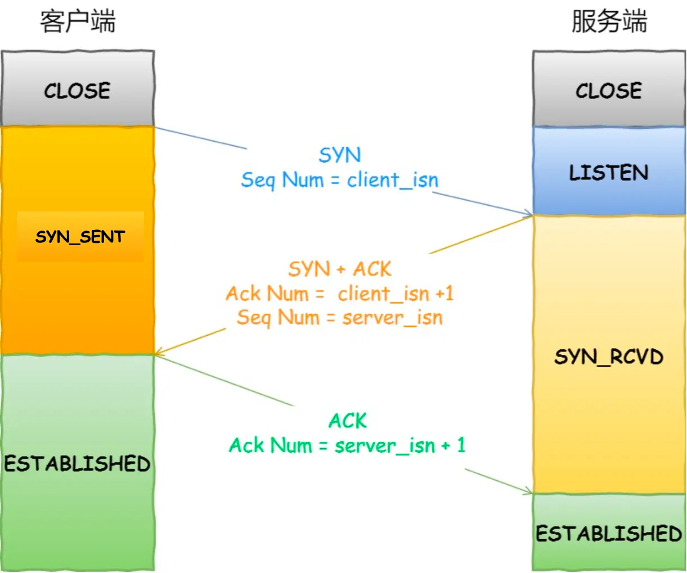
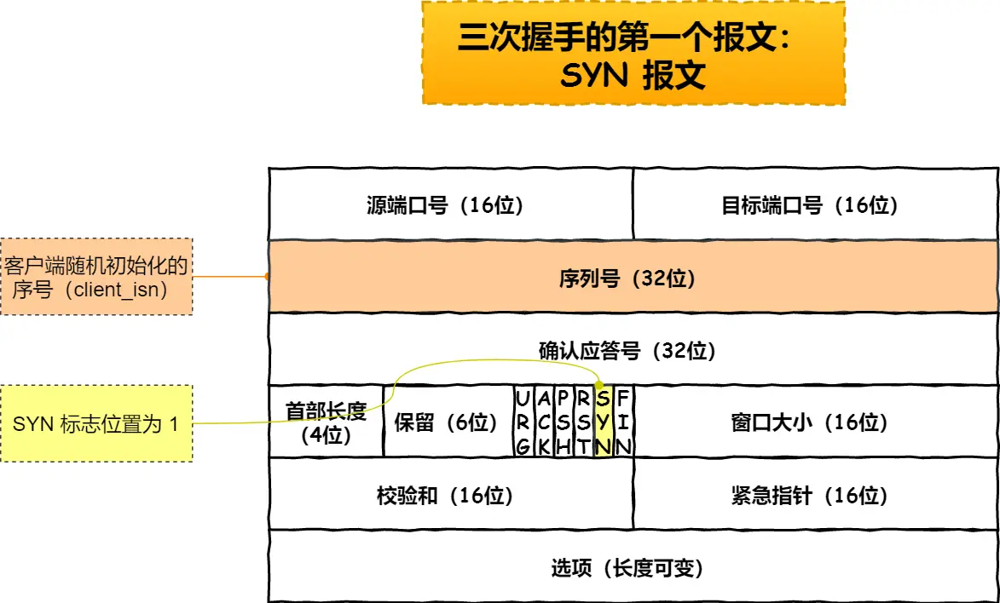
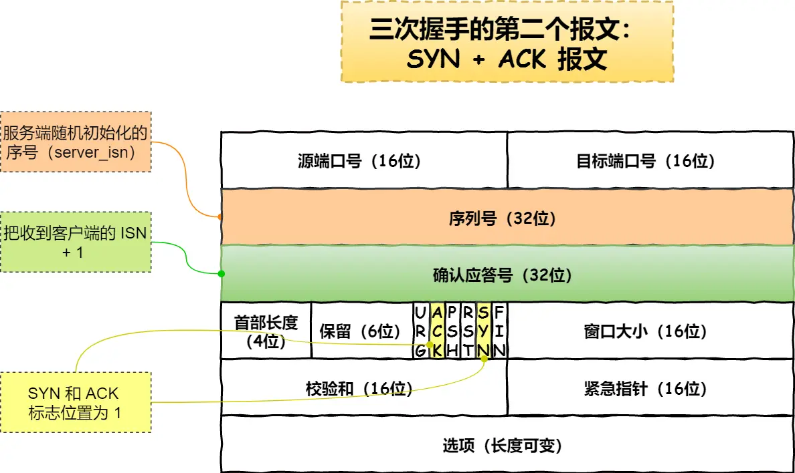
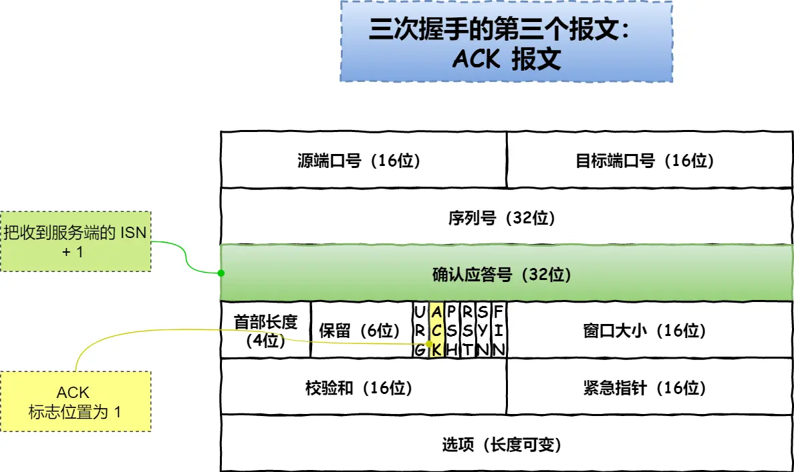
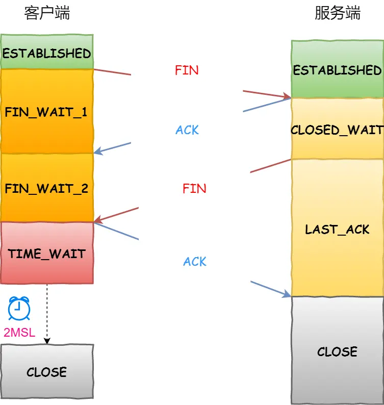

## 1.TCP 三次握手过程

- 首先客户端和服务端都处于 `CLOSE` 状态。先是服务端主动监听某个端口，处于 `LISTEN` 状态
- 客户端会随机初始化序号（`client_isn`），将此序号置于 TCP 首部的「序列号」字段中，同时把 `SYN` 标志位置为 `1`，表示 `SYN` 报文。接着把第一个 SYN 报文发送给服务端，表示向服务端发起连接，该报文不包含应用层数据，之后客户端处于 `SYN-SENT` 状态
- 服务端收到客户端的 `SYN` 报文后，首先服务端也随机初始化自己的序号（`server_isn`），将此序号填入 TCP 首部的「序列号」字段中，其次把 TCP 首部的「确认应答号」字段填入 `client_isn + 1`, 接着把 `SYN` 和 `ACK` 标志位置为 `1`。最后把该报文发给客户端，该报文也不包含应用层数据，之后服务端处于 `SYN-RCVD` 状态
- 客户端收到服务端报文后，还要向服务端回应最后一个应答报文，首先该应答报文 TCP 首部 `ACK` 标志位置为 `1` ，其次「确认应答号」字段填入 `server_isn + 1` ，最后把报文发送给服务端，这次报文可以携带客户到服务端的数据，之后客户端处于 `ESTABLISHED` 状态
- 服务端收到客户端的应答报文后，也进入 `ESTABLISHED` 状态

**三次握手的原因：**

- 三次握手才可以**阻止重复历史连接的初始化**（主要原因）：**两次握手的情况下，服务端没有中间状态给客户端来阻止历史连接，导致服务端可能建立一个历史连接，造成资源浪费**
- 三次握手才可以**同步双方的初始序列号**
- 三次握手才可以**避免资源浪费**：如果客户端发送的 `SYN` 报文在网络中阻塞了，重复发送多次 `SYN` 报文，那么服务端在收到请求后就会**建立多个冗余的无效链接，造成不必要的资源浪费**

## 2.TCP 四次挥手过程

- 如果客户端打算关闭连接，首先会发送一个 TCP 首部 `FIN` 标志位被置为 `1` 的 `FIN` 报文，之后客户端进入 `FIN_WAIT_1` 状态。
- 服务端收到该报文后，就向客户端发送 `ACK` 应答报文，接着服务端进入 `CLOSE_WAIT` 状态。
- 客户端收到服务端的 `ACK` 应答报文后，之后进入 `FIN_WAIT_2` 状态。
- 等待服务端处理完数据后，也向客户端发送 `FIN` 报文，之后服务端进入 `LAST_ACK` 状态。
- 客户端收到服务端的 `FIN` 报文后，回一个 `ACK` 应答报文，之后进入 `TIME_WAIT` 状态
- 服务端收到了 `ACK` 应答报文后，就进入了 `CLOSE` 状态，至此服务端已经完成连接的关闭。
- 客户端在经过 `2MSL` 一段时间后，自动进入 `CLOSE` 状态，至此客户端也完成连接的关闭。

## 3.TCP 和 UDP 区别

**1. 连接**

- TCP 是面向连接的传输层协议，传输数据前先要建立连接。
- UDP 是不需要连接，即刻传输数据。

**2. 服务对象**

- TCP 是一对一的两点服务，即一条连接只有两个端点。
- UDP 支持一对一、一对多、多对多的交互通信

**3. 可靠性**

- TCP 是可靠交付数据的，数据可以无差错、不丢失、不重复、按序到达。
- UDP 是尽最大努力交付，不保证可靠交付数据。但是我们可以基于 UDP 传输协议实现一个可靠的传输协议，比如 QUIC 协议。

**4. 拥塞控制、流量控制**

- TCP 有拥塞控制和流量控制机制，保证数据传输的安全性。
- UDP 则没有，即使网络非常拥堵了，也不会影响 UDP 的**发送速率**。

**5. 首部开销**

- TCP 首部长度较长，会有一定的开销，首部在没有使用「选项」字段时是 `20` 个字节，如果使用了「选项」字段则会变长的。
- UDP 首部只有 8 个字节，并且是固定不变的，开销较小。

**6. 传输方式**

- TCP 是流式传输，没有边界，但保证顺序和可靠。
- UDP 是一个包一个包的发送，是有边界的，但可能会丢包和乱序。

**7. 分片不同**

- TCP 的数据大小如果大于 MSS 大小，则会在传输层进行分片，目标主机收到后，也同样在传输层组装 TCP 数据包，如果中途丢失了一个分片，只需要传输丢失的这个分片。
- UDP 的数据大小如果大于 MTU 大小，则会在 IP 层进行分片，目标主机收到后，在 IP 层组装完数据，接着再传给传输层。

**TCP 和 UDP 应用场景：**

由于 TCP 是面向连接，能保证数据的可靠性交付，因此经常用于：

- `FTP` 文件传输；
- HTTP / HTTPS；

由于 UDP 面向无连接，它可以随时发送数据，再加上 UDP 本身的处理既简单又高效，因此经常用于：

- 包总量较少的通信，如 `DNS` 、`SNMP` 等；
- 视频、音频等多媒体通信；
- 广播通信。

## 4.为什么挥手需要四次

- 关闭连接时，客户端向服务端发送 `FIN` 时，仅仅表示客户端不再发送数据了但是还能接收数据。
- 服务端收到客户端的 `FIN` 报文时，先回一个 `ACK` 应答报文，而服务端可能还有数据需要处理和发送，等服务端不再发送数据时，才发送 `FIN` 报文给客户端来表示同意现在关闭连接。

而服务端通常需要等待完成数据的发送和处理，所以服务端的 `ACK` 和 `FIN` 一般都会分开发送，所以是需要四次挥手，但是**在特定情况下，四次挥手是可以变成三次挥手的**。（当被动关闭方在 TCP 挥手过程中，如果「没有数据要发送」，同时「没有开启 TCP_QUICKACK（默认情况就是没有开启，没有开启 TCP_QUICKACK，等于就是在使用 TCP 延迟确认机制）」，那么第二和第三次挥手就会合并传输，这样就出现了三次挥手。）

## 5.重传机制

- **超时重传：数据包丢失、确认应答丢失：**在发送数据时，设定一个定时器，当超过指定的时间后，没有收到对方的 `ACK` 确认应答报文，就会重发该数据
- **快速重传：不以时间为驱动，而是以数据驱动重传：**当收到三个相同的 ACK 报文时，会在定时器过期之前，重传丢失的报文段。（存在问题：重传一个，还是重传所有的问题）
- **SACK：选择性确认：**在 TCP 头部「选项」字段里加一个 `SACK` ，**可以将已收到的数据的信息发送给「发送方」**，这样发送方就可以知道哪些数据收到了，哪些数据没收到，可以**只重传丢失的数据**。
- **D-SACK：使用了 SACK 来告诉「发送方」有哪些数据被重复接收。**

## 6.滑动窗口

解决了往返时间越长，通信效率越低的问题，窗口大小就是指无需等待确认应答，而可以继续发送数据的最大值。（通常窗口的大小是由接收方的窗口大小来决定的，发送方发送的数据大小不能超过接收方的窗口大小，否则接收方就无法正常接收到数据）

## 7.流量控制

发送方将数据发送给接收方，要考虑接收方处理能力：TCP 提供一种机制可以让「发送方」根据「接收方」的实际接收能力控制发送的数据量，即流量控制。

## 8.拥塞控制

因为流量控制是避免「发送方」的数据填满「接收方」的缓存，但是并不知道网络的中发生了什么。而计算机网络都处在一个共享的环境。因此也有可能会因为其他主机之间的通信使得网络拥堵。**拥塞控制**的目的是**避免「发送方」的数据填满整个网络。**

拥塞控制主要是四个算法：

- **慢启动**
- **拥塞避免**
- **拥塞发生：超时重传、快速重传**
- **快速恢复**

## 9.TCP 序列号和确认号

**发送的 TCP 报文：**

- **公式一：序列号 = 上一次发送的序列号 + len（数据长度）。特殊情况，如果上一次发送的报文是 SYN 报文或者 FIN 报文，则改为 上一次发送的序列号 + 1。**
- **公式二：确认号 = 上一次收到的报文中的序列号 + len（数据长度）。特殊情况，如果收到的是 SYN 报文或者 FIN 报文，则改为上一次收到的报文中的序列号 + 1。**

三个字段的作用：

- **序列号**：在建立连接时由内核生成的随机数作为其初始值，通过 SYN 报文传给接收端主机，每发送一次数据，就「累加」一次该「数据字节数」的大小。**用来解决网络包乱序问题。**
- **确认号**：指下一次「期望」收到的数据的序列号，发送端收到接收方发来的 ACK 确认报文以后，就可以认为在这个序号以前的数据都已经被正常接收。**用来解决丢包的问题。**
- **控制位**：用来标识 TCP 报文是什么类型的报文，比如是 SYN 报文、数据报文、ACK 报文，FIN 报文等。

## 10.TIME_WAIT 的作用

- **防止历史连接中的数据，被后面相同四元组的连接错误的接收**
- **保证「被动关闭连接」的一方，能被正确的关闭**

## 11.TIME_WAIT 过多的危害

- 占用系统资源，比如文件描述符、内存资源、CPU 资源、线程资源等。
- 占用端口资源，端口资源也是有限的，一般可以开启的端口为 `32768～61000`，也可以通过 `net.ipv4.ip_local_port_range`参数指定范围。

## 12.TIME_WAIT 优化

- 打开 net.ipv4.tcp_tw_reuse 和 net.ipv4.tcp_timestamps 选项（可以**复用处于 TIME_WAIT 的 socket 为新的连接所用**）
- net.ipv4.tcp_max_tw_buckets（**当系统中处于 TIME_WAIT 的连接一旦超过这个值时，系统就会将后面的 TIME_WAIT 连接状态重置**）
- 程序中使用 SO_LINGER ，应用强制使用 RST 关闭

## 13.服务器出现大量 TIME_WAIT 状态的原因

首先要知道 TIME_WAIT 状态是主动关闭连接方才会出现的状态，所以如果服务器出现大量的 TIME_WAIT 状态的 TCP 连接，就是说明服务器主动断开了很多 TCP 连接，**服务端会主动断开连接呢的场景：**

- HTTP 没有使用长连接
- HTTP 长连接超时
- HTTP 长连接的请求数量达到上限

## 14.TCP 服务端的流程

1. 创建服务端 socket，bind 绑定端口、listen 监听端口
2. 将服务端 socket 注册到 **epoll**
3. **epoll_wait** 等待连接到来，连接到来时，调用 **accpet** 获取已连接的 **socket**
4. 将已连接的 **socket** 注册到 **epoll**
5. **epoll_wait** 等待事件发生
6. 对方连接关闭时，我方调用 close
