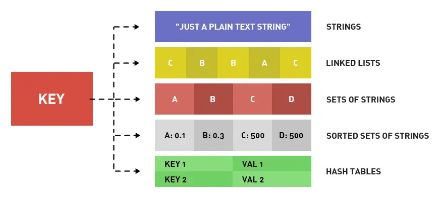
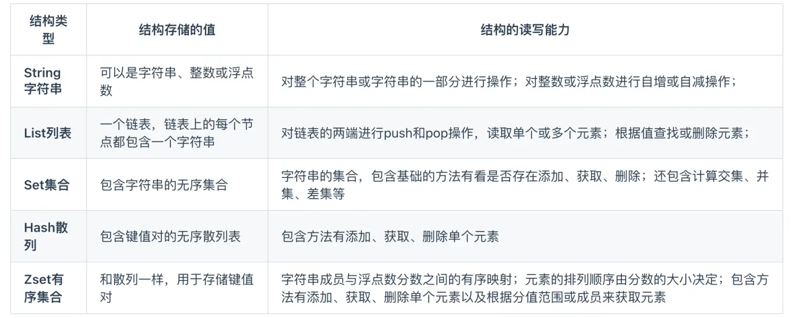
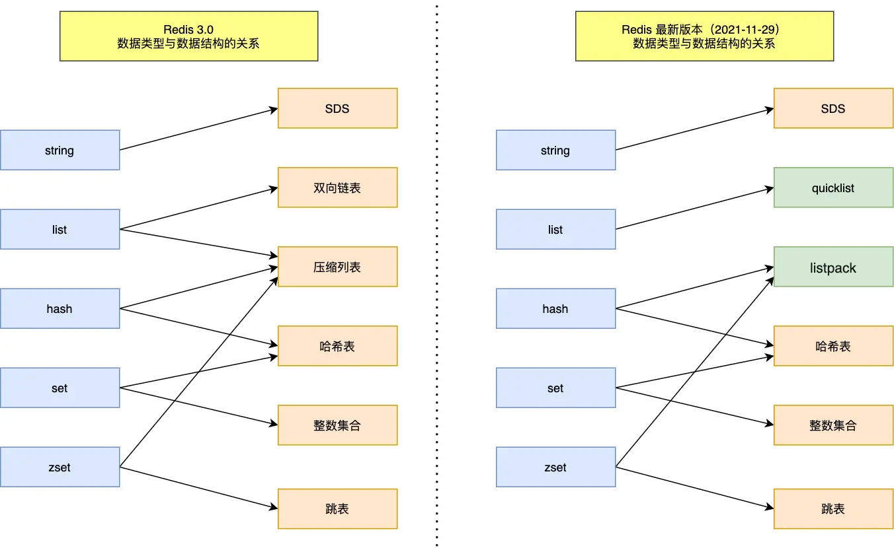
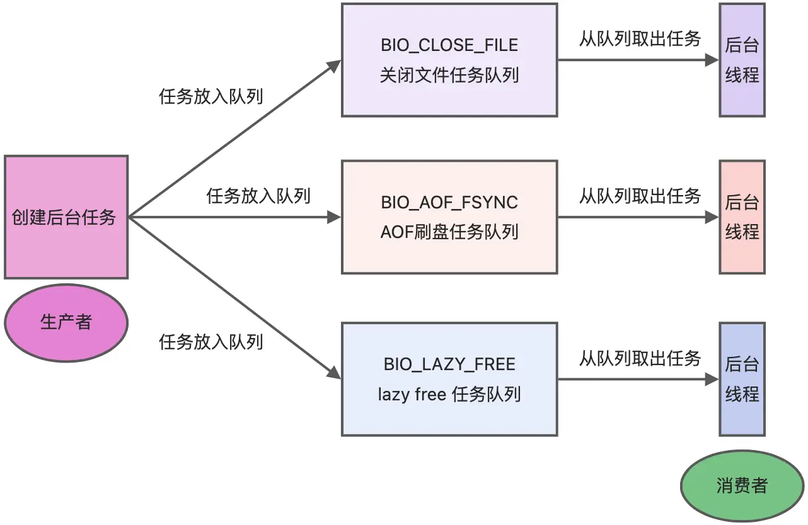
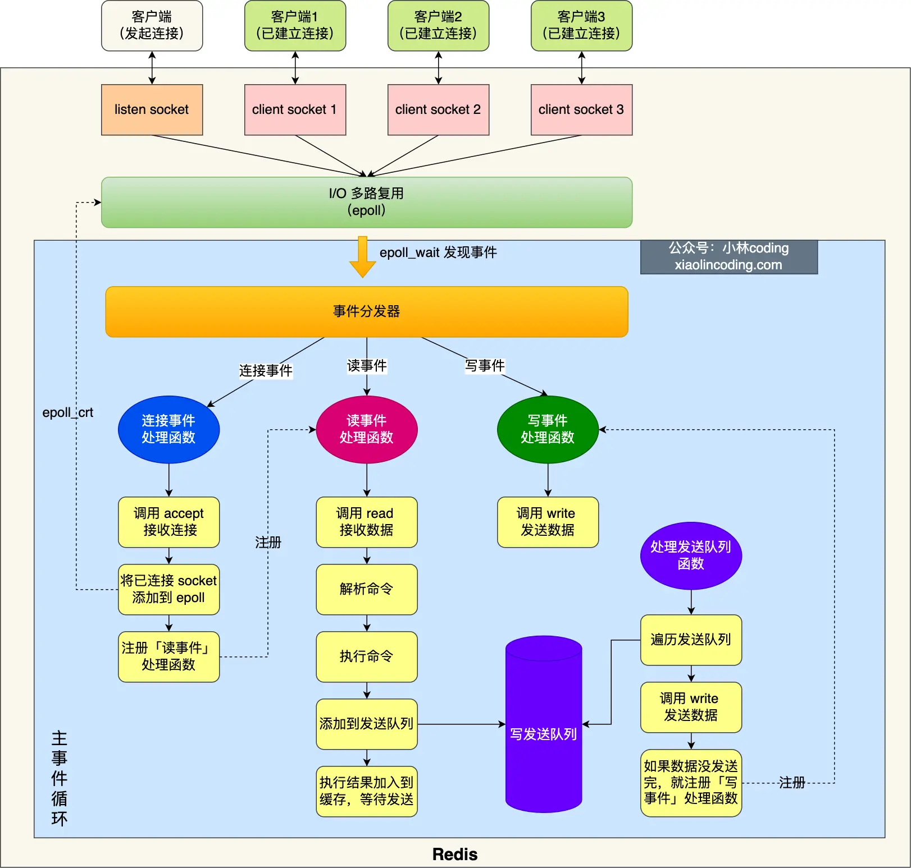
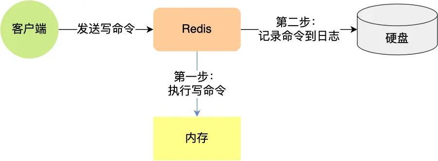
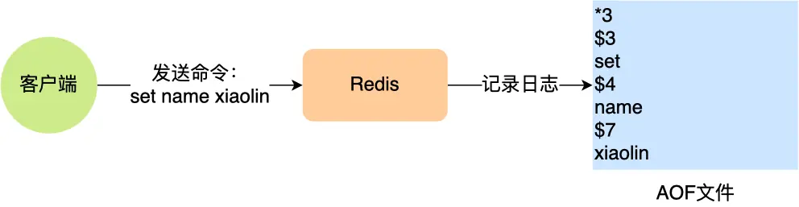

Redis 相关知识复习

## 1.基础知识

Redis：基于内存的数据库，数据的读写操作都是在内存中，常用于缓存、消息队列、分布式锁

Redis 对数据类型的操作都是**原子性**的（因为执行命令由单线程负责，不存在并发竞争问题）

Redis 可以作为 MySQL 的缓存，因为 Redis 具备高性能和高并发两种特性

## 2.Redis 数据结构

Redis 提供了丰富的数据类型，常见的有五种数据类型：**String（字符串），Hash（哈希），List（列表），Set（集合）、Zset（有序集合）**





随着 Redis 版本的更新，后面又支持了四种数据类型： **BitMap（2.2 版新增）、HyperLogLog（2.8 版新增）、GEO（3.2 版新增）、Stream（5.0 版新增）**。 Redis 五种数据类型的应用场景：

- String 类型的应用场景：缓存对象、常规计数、分布式锁、共享 session 信息等。
- List 类型的应用场景：消息队列（但是有两个问题：1. 生产者需要自行实现全局唯一 ID；2. 不能以消费组形式消费数据）等。
- Hash 类型：缓存对象、购物车等。
- Set 类型：聚合计算（并集、交集、差集）场景，比如点赞、共同关注、抽奖活动等。
- Zset 类型：排序场景，比如排行榜、电话和姓名排序等。

Redis 后续版本又支持四种数据类型，它们的应用场景如下：

- BitMap（2.2 版新增）：二值状态统计的场景，比如签到、判断用户登陆状态、连续签到用户总数等；
- HyperLogLog（2.8 版新增）：海量数据基数统计的场景，比如百万级网页 UV 计数等；
- GEO（3.2 版新增）：存储地理位置信息的场景，比如滴滴叫车；
- Stream（5.0 版新增）：消息队列，相比于基于 List 类型实现的消息队列，有这两个特有的特性：自动生成全局唯一消息ID，支持以消费组形式消费数据。




## 3.Redis 线程模型

**Redis 单线程指的是「接收客户端请求->解析请求 ->进行数据读写等操作->发送数据给客户端」这个过程是由一个线程（主线程）来完成的**，这也是我们常说 Redis 是单线程的原因。

但是，**Redis 程序并不是单线程的**，Redis 在启动的时候，是会**启动后台线程**（BIO）的：

- **Redis 在 2.6 版本**，会启动 2 个后台线程，分别处理关闭文件、AOF 刷盘这两个任务；
- **Redis 在 4.0 版本之后**，新增了一个新的后台线程，用来异步释放 Redis 内存，也就是 lazyfree 线程。例如执行 unlink key / flushdb async / flushall async 等命令，会把这些删除操作交给后台线程来执行，好处是不会导致 Redis 主线程卡顿。因此，当我们要删除一个大 key 的时候，不要使用 del 命令删除，因为 del 是在主线程处理的，这样会导致 Redis 主线程卡顿，因此我们应该使用 unlink 命令来异步删除大key。

之所以 Redis 为「关闭文件、AOF 刷盘、释放内存」这些任务创建单独的线程来处理，是因为这些任务的操作都是很耗时的，如果把这些任务都放在主线程来处理，那么 Redis 主线程就很容易发生阻塞，这样就无法处理后续的请求了。

后台线程相当于一个消费者，生产者把耗时任务丢到任务队列中，消费者（BIO）不停轮询这个队列，拿出任务就去执行对应的方法即可。



关闭文件、AOF 刷盘、释放内存这三个任务都有各自的任务队列：

- BIO_CLOSE_FILE，关闭文件任务队列：当队列有任务后，后台线程会调用 close(fd) ，将文件关闭；
- BIO_AOF_FSYNC，AOF刷盘任务队列：当 AOF 日志配置成 everysec 选项后，主线程会把 AOF 写日志操作封装成一个任务，也放到队列中。当发现队列有任务后，后台线程会调用 fsync(fd)，将 AOF 文件刷盘，
- BIO_LAZY_FREE，lazy free 任务队列：当队列有任务后，后台线程会 free(obj) 释放对象 / free(dict) 删除数据库所有对象 / free(skiplist) 释放跳表对象；

### 3.1 Redis 单线程模式



图中的蓝色部分是一个事件循环，是由主线程负责的，可以看到网络 I/O 和命令处理都是单线程。 Redis 初始化的时候，会做下面这几件事情：

- 首先，调用 epoll_create() 创建一个 epoll 对象和调用 socket() 创建一个服务端 socket
- 然后，调用 bind() 绑定端口和调用 listen() 监听该 socket；
- 然后，将调用 epoll_ctl() 将 listen socket 加入到 epoll，同时注册「连接事件」处理函数。

初始化完后，主线程就进入到一个**事件循环函数**，主要会做以下事情：

- 首先，先调用**处理发送队列函数**，看是发送队列里是否有任务，如果有发送任务，则通过 write 函数将客户端发送缓存区里的数据发送出去，如果这一轮数据没有发送完，就会注册写事件处理函数，等待 epoll_wait 发现可写后再处理 。
- 接着，调用 epoll_wait 函数等待事件的到来：
    - 如果是**连接事件**到来，则会调用**连接事件处理函数**，该函数会做这些事情：调用 accpet 获取已连接的 socket -> 调用 epoll_ctl 将已连接的 socket 加入到 epoll -> 注册「读事件」处理函数；
    - 如果是**读事件**到来，则会调用**读事件处理函数**，该函数会做这些事情：调用 read 获取客户端发送的数据 -> 解析命令 -> 处理命令 -> 将客户端对象添加到发送队列 -> 将执行结果写到发送缓存区等待发送；
    - 如果是**写事件**到来，则会调用**写事件处理函数**，该函数会做这些事情：通过 write 函数将客户端发送缓存区里的数据发送出去，如果这一轮数据没有发送完，就会继续注册写事件处理函数，等待 epoll_wait 发现可写后再处理 。

Redis 采用单线程（网络 I/O 和执行命令）那么快，有如下几个原因：

- Redis 的大部分操作**都在内存中完成**，并且采用了高效的数据结构，因此 Redis 瓶颈可能是机器的内存或者网络带宽，而并非 CPU，既然 CPU 不是瓶颈，那么自然就采用单线程的解决方案了；
- Redis 采用单线程模型可以**避免了多线程之间的竞争**，省去了多线程切换带来的时间和性能上的开销，而且也不会导致死锁问题。
- Redis 采用了 **I/O 多路复用机制**处理大量的客户端 Socket 请求，IO 多路复用机制是指一个线程处理多个 IO 流，就是我们经常听到的 select/epoll 机制。简单来说，在 Redis 只运行单线程的情况下，该机制允许内核中，同时存在多个监听 Socket 和已连接 Socket。内核会一直监听这些 Socket 上的连接请求或数据请求。一旦有请求到达，就会交给 Redis 线程处理，这就实现了一个 Redis 线程处理多个 IO 流的效果。

### 3.2 Redis 性能瓶颈

Redis的**性能瓶颈有时会出现在网络I/O的处理**上，这是因为Redis是一个内存数据库，它的性能主要受限于以下几个因素：

1. **单线程模型：** Redis 采用了单线程模型，意味着所有的命令都在一个单独的线程中执行。这个线程负责处理所有的客户端请求、命令解析、数据读写和持久化操作。虽然这样的设计简单且易于维护，但在高并发的情况下，单线程的性能可能会受限。
2. **内存访问：** Redis 的数据通常存储在内存中，因此快速的内存访问对性能至关重要。然而，当数据量很大时，内存访问可能会变得相对较慢，因为需要更多的内存管理和缓存机制来处理大量的数据。
3. **网络 I/O：** Redis 通常用于客户端和服务器之间的通信，因此网络I/O的性能对于Redis非常关键。在高并发情况下，大量的客户端请求需要在网络上传输，而网络带宽和延迟可能会成为性能瓶颈。
4. **持久化操作：** 如果 Redis 启用了持久化操作（如 RDB 快照或 AOF 日志），这些操作可能会对性能产生影响。在持久化期间，Redis需要将数据写入磁盘，这可能会导致磁盘 I/O 成为性能瓶颈。

解决Redis性能瓶颈的方法包括：

- **使用多实例：** 在多核 CPU 上运行多个 Redis 实例，每个实例可以处理不同的命令或数据集，以提高并发性能。
- **使用缓存：** 将热点数据缓存在 Redis 中，以减少对数据库的访问。
- **使用集群：** Redis 提供了集群模式，可以在多个 Redis 节点之间分布数据和负载，以提高性能和可伸缩性。
- **优化网络配置：** 调整网络配置，包括 TCP 参数、最大连接数和超时设置，以改善网络 I/O 性能.
- **合理使用持久化：** 根据需求合理配置持久化操作，可以选择关闭持久化或将持久化数据存储在快速的存储介质上。

### 3.3 Redis 6.0 之后引入多线程

虽然 Redis 的主要工作（网络 I/O 和执行命令）一直是单线程模型，但是**在 Redis 6.0 版本之后，也采用了多个 I/O 线程来处理网络请求**，**这是因为随着网络硬件的性能提升，Redis 的性能瓶颈有时会出现在网络 I/O 的处理上**。

所以为了提高网络 I/O 的并行度，Redis 6.0 对于网络 I/O 采用多线程来处理。**但是对于命令的执行，Redis 仍然使用单线程来处理，**所以大家**不要误解** Redis 有多线程同时执行命令。

Redis 官方表示，**Redis 6.0 版本引入的多线程 I/O 特性对性能提升至少是一倍以上**。

Redis 6.0 版本支持的 I/O 多线程特性，默认情况下 I/O 多线程只针对发送响应数据（write client socket），并不会以多线程的方式处理读请求（read client socket）。要想开启多线程处理客户端读请求，就需要把 Redis.conf 配置文件中的 io-threads-do-reads 配置项设为 yes。

```shell
//读请求也使用io多线程
io-threads-do-reads yes 
```

同时， Redis.conf 配置文件中提供了 IO 多线程个数的配置项。

```shell
// io-threads N，表示启用 N-1 个 I/O 多线程（主线程也算一个 I/O 线程）
io-threads 4 
```

关于线程数的设置，官方的建议是如果为 4 核的 CPU，建议线程数设置为 2 或 3，如果为 8 核 CPU 建议线程数设置为 6，线程数一定要小于机器核数，线程数并不是越大越好。

因此， Redis 6.0 版本之后，Redis 在启动的时候，默认情况下会**额外创建 6 个线程**（_这里的线程数不包括主线程_）：

- Redis-server ： Redis的主线程，主要负责执行命令；
- bio_close_file、bio_aof_fsync、bio_lazy_free：三个后台线程，分别异步处理关闭文件任务、AOF刷盘任务、释放内存任务；
- io_thd_1、io_thd_2、io_thd_3：三个 I/O 线程，io-threads 默认是 4 ，所以会启动 3（4-1）个 I/O 多线程，用来分担 Redis 网络 I/O 的压力。

## 4.Redis 持久化

Redis 的读写操作都是在内存中，所以 Redis 性能才会高，但是当 Redis 重启后，内存中的数据就会丢失，那为了保证内存中的数据不会丢失，Redis 实现了数据持久化的机制，这个机制会把数据存储到磁盘，这样在 Redis 重启就能够从磁盘中恢复原有的数据。

Redis 共有三种数据持久化的方式：

- **AOF 日志**：每执行一条写操作命令，就把该命令以追加的方式写入到一个文件里；
- **RDB 快照**：将某一时刻的内存数据，以二进制的方式写入磁盘；
- **混合持久化方式**：Redis 4.0 新增的方式，集成了 AOF 和 RBD 的优点；

### 4.1 AOF 日志

Redis 在执行完一条写操作命令后，就会把该命令以追加的方式写入到一个文件里，然后 Redis 重启时，会读取该文件记录的命令，然后逐一执行命令的方式来进行数据恢复。



我这里以「_set name xiaolin_」命令作为例子，Redis 执行了这条命令后，记录在 AOF 日志里的内容如下图：



