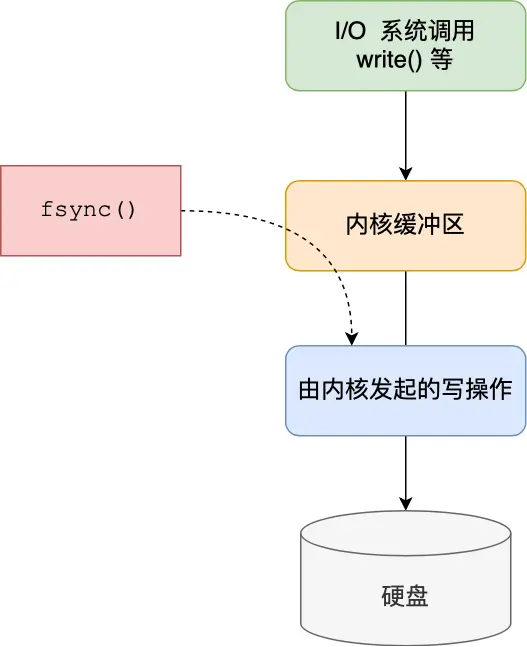
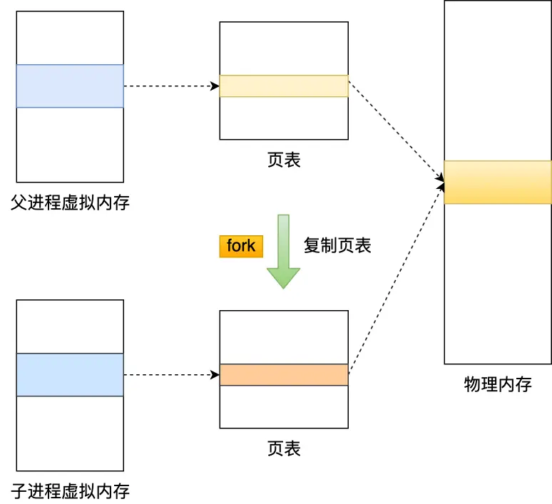
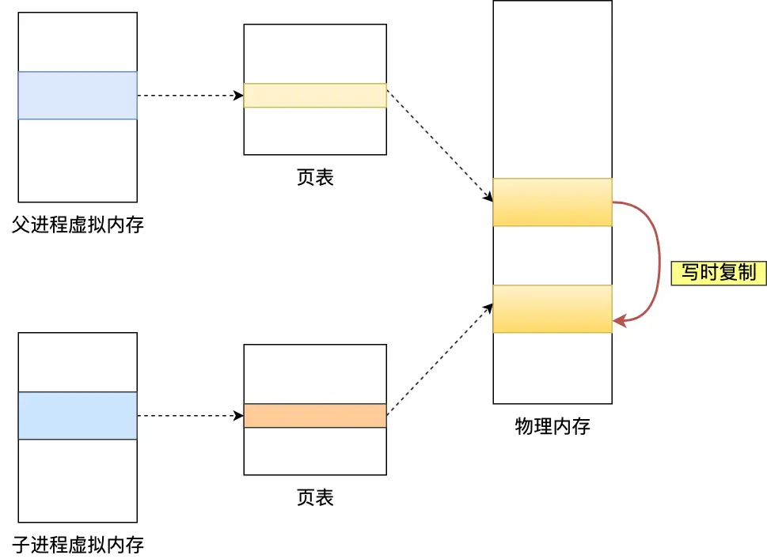

Redis 中 大 Key 相关问题总结

## 1.Redis 的大 key 如何处理

> 什么是 Redis 大 key？

大 key 并不是指 key 的值很大，而是 key 对应的 value 很大。

一般而言，下面这两种情况被称为大 key：

- String 类型的值大于 10 KB；
- Hash、List、Set、ZSet 类型的元素的个数超过 5000个；

> 大 key 会造成什么问题？

大 key 会带来以下四种影响：

- **客户端超时阻塞**。由于 Redis 执行命令是单线程处理，然后在操作大 key 时会比较耗时，那么就会阻塞 Redis，从客户端这一视角看，就是很久很久都没有响应。
- **引发网络阻塞**。每次获取大 key 产生的网络流量较大，如果一个 key 的大小是 1 MB，每秒访问量为 1000，那么每秒会产生 1000MB 的流量，这对于普通千兆网卡的服务器来说是灾难性的。
- **阻塞工作线程**。如果使用 del 删除大 key 时，会阻塞工作线程，这样就没办法处理后续的命令。
- **内存分布不均**。集群模型在 slot 分片均匀情况下，会出现数据和查询倾斜情况，部分有大 key 的 Redis 节点占用内存多，QPS 也会比较大。

> 如何找到大 key ？

**1、redis-cli --bigkeys 查找大key**

可以通过 redis-cli --bigkeys 命令查找大 key：

```shell
redis-cli -h 127.0.0.1 -p6379 -a "password" -- bigkeys
```

使用的时候注意事项：

- 最好选择在从节点上执行该命令。因为主节点上执行时，会阻塞主节点；
- 如果没有从节点，那么可以选择在 Redis 实例业务压力的低峰阶段进行扫描查询，以免影响到实例的正常运行；或者可以使用 -i 参数控制扫描间隔，避免长时间扫描降低 Redis 实例的性能。

该方式的不足之处：

- 这个方法只能返回每种类型中最大的那个 bigkey，无法得到大小排在前 N 位的 bigkey；
- 对于集合类型来说，这个方法只统计集合元素个数的多少，而不是实际占用的内存量。但是，一个集合中的元素个数多，并不一定占用的内存就多。因为，有可能每个元素占用的内存很小，这样的话，即使元素个数有很多，总内存开销也不大；

**2、使用 SCAN 命令查找大 key**

使用 SCAN 命令对数据库扫描，然后用 TYPE 命令获取返回的每一个 key 的类型。

对于 String 类型，可以直接使用 STRLEN 命令获取字符串的长度，也就是占用的内存空间字节数。

对于集合类型来说，有两种方法可以获得它占用的内存大小：

- 如果能够预先从业务层知道集合元素的平均大小，那么，可以使用下面的命令获取集合元素的个数，然后乘以集合元素的平均大小，这样就能获得集合占用的内存大小了。List 类型：`LLEN` 命令；Hash 类型：`HLEN` 命令；Set 类型：`SCARD` 命令；Sorted Set 类型：`ZCARD` 命令；
- 如果不能提前知道写入集合的元素大小，可以使用 `MEMORY USAGE` 命令（需要 Redis 4.0 及以上版本），查询一个键值对占用的内存空间。

**3、使用 RdbTools 工具查找大 key**

使用 RdbTools 第三方开源工具，可以用来解析 Redis 快照（RDB）文件，找到其中的大 key。

比如，下面这条命令，将大于 10 kb 的  key  输出到一个表格文件。

```shell
rdb dump.rdb -c memory --bytes 10240 -f redis.csv
```

> 如何删除大 key？

删除操作的本质是要释放键值对占用的内存空间，不要小瞧内存的释放过程。

释放内存只是第一步，为了更加高效地管理内存空间，在应用程序释放内存时，操作系统需要把释放掉的内存块插入一个空闲内存块的链表，以便后续进行管理和再分配。这个过程本身需要一定时间，而且会阻塞当前释放内存的应用程序。

所以，如果一下子释放了大量内存，空闲内存块链表操作时间就会增加，相应地就会造成 Redis 主线程的阻塞，如果主线程发生了阻塞，其他所有请求可能都会超时，超时越来越多，会造成 Redis 连接耗尽，产生各种异常。

因此，删除大 key 这一个动作，我们要小心。具体要怎么做呢？这里给出两种方法：

- 分批次删除
- 异步删除（Redis 4.0版本以上）

**1、分批次删除**

对于**删除大 Hash**，使用 `hscan` 命令，每次获取 100 个字段，再用 `hdel` 命令，每次删除 1 个字段。

Python代码：

```python
def del_large_hash():
  r = redis.StrictRedis(host='redis-host1', port=6379)
    large_hash_key ="xxx" #要删除的大hash键名
    cursor = '0'
    while cursor != 0:
        # 使用 hscan 命令，每次获取 100 个字段
        cursor, data = r.hscan(large_hash_key, cursor=cursor, count=100)
        for item in data.items():
                # 再用 hdel 命令，每次删除1个字段
                r.hdel(large_hash_key, item[0])
```

对于**删除大 List**，通过 `ltrim` 命令，每次删除少量元素。

Python代码：

```python
def del_large_list():
  r = redis.StrictRedis(host='redis-host1', port=6379)
  large_list_key = 'xxx'  #要删除的大list的键名
  while r.llen(large_list_key)>0:
      #每次只删除最右100个元素
      r.ltrim(large_list_key, 0, -101) 
```

对于**删除大 Set**，使用 `sscan` 命令，每次扫描集合中 100 个元素，再用 `srem` 命令每次删除一个键。

Python代码：

```python
def del_large_set():
  r = redis.StrictRedis(host='redis-host1', port=6379)
  large_set_key = 'xxx'   # 要删除的大set的键名
  cursor = '0'
  while cursor != 0:
    # 使用 sscan 命令，每次扫描集合中 100 个元素
    cursor, data = r.sscan(large_set_key, cursor=cursor, count=100)
    for item in data:
      # 再用 srem 命令每次删除一个键
      r.srem(large_size_key, item)
```

对于**删除大 ZSet**，使用 `zremrangebyrank` 命令，每次删除 top 100个元素。

Python代码：

```python
def del_large_sortedset():
  r = redis.StrictRedis(host='large_sortedset_key', port=6379)
  large_sortedset_key='xxx'
  while r.zcard(large_sortedset_key)>0:
    # 使用 zremrangebyrank 命令，每次删除 top 100个元素
    r.zremrangebyrank(large_sortedset_key,0,99) 
```

**2、异步删除**

从 Redis 4.0 版本开始，可以采用**异步删除**法，**用 unlink 命令代替 del 来删除**。

这样 Redis 会将这个 key 放入到一个异步线程中进行删除，这样不会阻塞主线程。

除了主动调用 unlink 命令实现异步删除之外，我们还可以通过配置参数，达到某些条件的时候自动进行异步删除。

主要有 4 种场景，默认都是关闭的：

```python
lazyfree-lazy-eviction no
lazyfree-lazy-expire no
lazyfree-lazy-server-del
noslave-lazy-flush no
```

它们代表的含义如下：

- lazyfree-lazy-eviction：表示当 Redis 运行内存超过 maxmeory 时，是否开启 lazy free 机制删除；
- lazyfree-lazy-expire：表示设置了过期时间的键值，当过期之后是否开启 lazy free 机制删除；
- lazyfree-lazy-server-del：有些指令在处理已存在的键时，会带有一个隐式的 del 键的操作，比如 rename 命令，当目标键已存在，Redis 会先删除目标键，如果这些目标键是一个 big key，就会造成阻塞删除的问题，此配置表示在这种场景中是否开启 lazy free 机制删除；
- slave-lazy-flush：针对 slave (从节点) 进行全量数据同步，slave 在加载 master 的 RDB 文件前，会运行 flushall 来清理自己的数据，它表示此时是否开启 lazy free 机制删除。

建议开启其中的 lazyfree-lazy-eviction、lazyfree-lazy-expire、lazyfree-lazy-server-del 等配置，这样就可以有效的提高主线程的执行效率。

## 2.大 Key 对 AOF 日志的影响

> 先说说 AOF 日志三种写回磁盘的策略

Redis 提供了 3 种 AOF 日志写回硬盘的策略，分别是：

- Always，这个单词的意思是「总是」，所以它的意思是每次写操作命令执行完后，同步将 AOF 日志数据写回硬盘；
- Everysec，这个单词的意思是「每秒」，所以它的意思是每次写操作命令执行完后，先将命令写入到 AOF 文件的内核缓冲区，然后每隔一秒将缓冲区里的内容写回到硬盘；
- No，意味着不由 Redis 控制写回硬盘的时机，转交给操作系统控制写回的时机，也就是每次写操作命令执行完后，先将命令写入到 AOF 文件的内核缓冲区，再由操作系统决定何时将缓冲区内容写回硬盘。

这三种策略只是在控制 fsync() 函数的调用时机。

当应用程序向文件写入数据时，内核通常先将数据复制到内核缓冲区中，然后排入队列，然后由内核决定何时写入硬盘。



如果想要应用程序向文件写入数据后，能立马将数据同步到硬盘，就可以调用 fsync() 函数，这样内核就会将内核缓冲区的数据直接写入到硬盘，等到硬盘写操作完成后，该函数才会返回。

- Always 策略就是每次写入 AOF 文件数据后，就执行 fsync() 函数；
- Everysec 策略就会创建一个异步任务来执行 fsync() 函数；
- No 策略就是永不执行 fsync() 函数;

> 分别说说这三种策略，在持久化大 Key 的时候，会影响什么？

在使用 Always 策略的时候，主线程在执行完命令后，会把数据写入到 AOF 日志文件，然后会调用 fsync() 函数，将内核缓冲区的数据直接写入到硬盘，等到硬盘写操作完成后，该函数才会返回。

**当使用 Always 策略的时候，如果写入是一个大 Key，主线程在执行 fsync() 函数的时候，阻塞的时间会比较久，因为当写入的数据量很大的时候，数据同步到硬盘这个过程是很耗时的**。

当使用 Everysec 策略的时候，由于是异步执行 fsync() 函数，所以大 Key 持久化的过程（数据同步磁盘）不会影响主线程。

当使用 No 策略的时候，由于永不执行 fsync() 函数，所以大 Key 持久化的过程不会影响主线程。

## 3.大 Key 对 AOF 重写和 RDB 的影响

当 AOF 日志写入了很多的大 Key，AOF 日志文件的大小会很大，那么很快就会触发 **AOF 重写机制**。

AOF 重写机制和 RDB 快照（bgsave 命令）的过程，都会分别通过 `fork()` 函数创建一个子进程来处理任务。

在创建子进程的过程中，操作系统会把父进程的「页表」复制一份给子进程，这个页表记录着虚拟地址和物理地址映射关系，而不会复制物理内存，也就是说，两者的虚拟空间不同，但其对应的物理空间是同一个。



这样一来，子进程就共享了父进程的物理内存数据了，这样能够节约物理内存资源，页表对应的页表项的属性会标记该物理内存的权限为**只读**。

随着 Redis 存在越来越多的大 Key，那么 Redis 就会占用很多内存，对应的页表就会越大。

在通过 `fork()` 函数创建子进程的时候，虽然不会复制父进程的物理内存，但是**内核会把父进程的页表复制一份给子进程，如果页表很大，那么这个复制过程是会很耗时的，那么在执行 fork 函数的时候就会发生阻塞现象**。

而且，fork 函数是由 Redis 主线程调用的，如果 fork 函数发生阻塞，那么意味着就会阻塞 Redis 主线程。由于 Redis 执行命令是在主线程处理的，所以当 Redis 主线程发生阻塞，就无法处理后续客户端发来的命令。

我们可以执行 `info` 命令获取到 latest_fork_usec 指标，表示 Redis 最近一次 fork 操作耗时。

```shell
# 最近一次 fork 操作耗时
latest_fork_usec:315
```

如果 fork 耗时很大，比如超过1秒，则需要做出优化调整：

- 单个实例的内存占用控制在 10 GB 以下，这样 fork 函数就能很快返回。
- 如果 Redis 只是当作纯缓存使用，不关心 Redis 数据安全性问题，可以考虑关闭 AOF 和 AOF 重写，这样就不会调用 fork 函数了。
- 在主从架构中，要适当调大 repl-backlog-size，避免因为 repl_backlog_buffer 不够大，导致主节点频繁地使用全量同步的方式，全量同步的时候，是会创建 RDB 文件的，也就是会调用 fork 函数。

> 那什么时候会发生物理内存的复制呢？

当父进程或者子进程在向共享内存发起写操作时，CPU 就会触发**写保护中断**，这个「写保护中断」是由于违反权限导致的，然后操作系统会在「写保护中断处理函数」里进行物理内存的复制，并重新设置其内存映射关系，将父子进程的内存读写权限设置为可读写，最后才会对内存进行写操作，这个过程被称为「**写时复制(Copy On Write)**」。



写时复制顾名思义，在发生写操作的时候，操作系统才会去复制物理内存，这样是为了防止 fork 创建子进程时，由于物理内存数据的复制时间过长而导致父进程长时间阻塞的问题。

如果创建完子进程后，**父进程对共享内存中的大 Key 进行了修改，那么内核就会发生写时复制，会把物理内存复制一份，由于大 Key 占用的物理内存是比较大的，那么在复制物理内存这一过程中，也是比较耗时的，于是父进程（主线程）就会发生阻塞**。

所以，有两个阶段会导致阻塞父进程：

- 创建子进程的途中，由于要复制父进程的页表等数据结构，阻塞的时间跟页表的大小有关，页表越大，阻塞的时间也越长；
- 创建完子进程后，如果子进程或者父进程修改了共享数据，就会发生写时复制，这期间会拷贝物理内存，如果内存越大，自然阻塞的时间也越长；

这里额外提一下， 如果 **Linux 开启了内存大页，会影响 Redis 的性能的**。

Linux 内核从 2.6.38 开始支持内存大页机制，该机制支持 2MB 大小的内存页分配，而常规的内存页分配是按 4KB 的粒度来执行的。

如果采用了内存大页，那么即使客户端请求只修改 100B 的数据，在发生写时复制后，Redis 也需要拷贝 2MB 的大页。相反，如果是常规内存页机制，只用拷贝 4KB。

两者相比，你可以看到，每次写命令引起的**复制内存页单位放大了 512 倍，会拖慢写操作的执行时间，最终导致 Redis 性能变慢**。

那该怎么办呢？很简单，关闭内存大页（默认是关闭的）。

禁用方法如下：

```shell
echo never >  /sys/kernel/mm/transparent_hugepage/enabled
```
