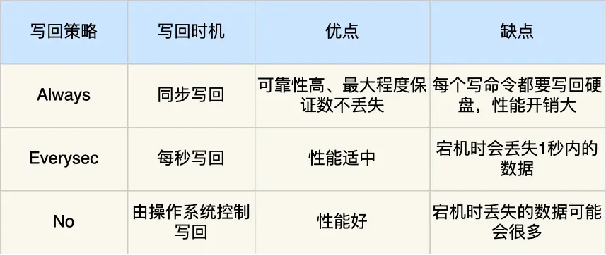
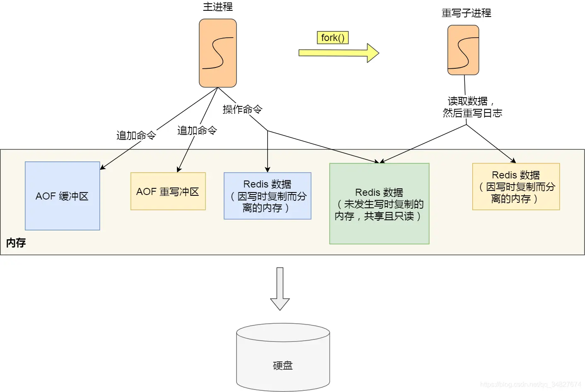
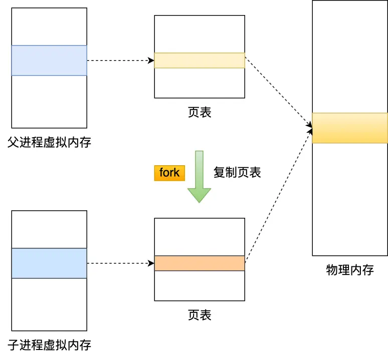

Redis 持久化过程中的相关问题

## 1.AOF 日志

Redis 里的 **AOF(Append Only File)** 持久化功能，**注意只会记录写操作命令，读操作命令是不会被记录的**，因为没意义。


AOF 日志文件其实就是普通的文本，我们可以通过 `cat` 命令查看里面的内容：


「`*3`」表示当前命令有三个部分，每部分都是以「`$+数字`」开头，后面紧跟着具体的命令、键或值。然后，这里的「`数字`」表示这部分中的命令、键或值一共有多少字节。例如，「`$3 set`」表示这部分有 3 个字节，也就是「`set`」命令这个字符串的长度。

不知道大家注意到没有，Redis 是先执行写操作命令后，才将该命令记录到 AOF 日志里的，这么做其实有两个好处。

第一个好处，**避免额外的检查开销。**

因为如果先将写操作命令记录到 AOF 日志里，再执行该命令的话，如果当前的命令语法有问题，那么如果不进行命令语法检查，该错误的命令记录到 AOF 日志里后，Redis 在使用日志恢复数据时，就可能会出错。

而如果先执行写操作命令再记录日志的话，只有在该命令执行成功后，才将命令记录到 AOF 日志里，这样就不用额外的检查开销，保证记录在 AOF 日志里的命令都是可执行并且正确的。

第二个好处，**不会阻塞当前写操作命令的执行**，因为当写操作命令执行成功后，才会将命令记录到 AOF 日志。

**AOF 持久化功能的潜在风险**：

第一个风险，执行写操作命令和记录日志是两个过程，那当 Redis 在还没来得及将命令写入到硬盘时，服务器发生宕机了，这个数据就会有**丢失的风险**。

第二个风险，前面说道，由于写操作命令执行成功后才记录到 AOF 日志，所以不会阻塞当前写操作命令的执行，但是**可能会给「下一个」命令带来阻塞风险**。

因为将命令写入到日志的这个操作也是在主进程完成的（执行命令也是在主进程），也就是说这两个操作是同步的。


如果在将日志内容写入到硬盘时，服务器的硬盘的 I/O 压力太大，就会导致写硬盘的速度很慢，进而阻塞住了，也就会导致后续的命令无法执行。

认真分析一下，其实这两个风险都有一个共性，都跟「 AOF 日志写回硬盘的时机」有关。

### 1.1 AOF 三种写回策略


1. Redis 执行完写操作命令后，会将命令追加到 `server.aof_buf` 缓冲区；
2. 然后通过 write() 系统调用，将 aof_buf 缓冲区的数据写入到 AOF 文件，此时数据并没有写入到硬盘，而是拷贝到了内核缓冲区 page cache，等待内核将数据写入硬盘；
3. 具体内核缓冲区的数据什么时候写入到硬盘，由内核决定。

Redis 提供了 3 种写回硬盘的策略，控制的就是上面说的第三步的过程。

在 `redis.conf` 配置文件中的 `appendfsync` 配置项可以有以下 3 种参数可填：

- **Always**，这个单词的意思是「总是」，所以它的意思是每次写操作命令执行完后，同步将 AOF 日志数据写回硬盘；
- **Everysec**，这个单词的意思是「每秒」，所以它的意思是每次写操作命令执行完后，先将命令写入到 AOF 文件的内核缓冲区，然后每隔一秒将缓冲区里的内容写回到硬盘；
- **No**，意味着不由 Redis 控制写回硬盘的时机，转交给操作系统控制写回的时机，也就是每次写操作命令执行完后，先将命令写入到 AOF 文件的内核缓冲区，再由操作系统决定何时将缓冲区内容写回硬盘。

这 3 种写回策略都无法能完美解决「主进程阻塞」和「减少数据丢失」的问题，因为两个问题是对立的，偏向于一边的话，就会要牺牲另外一边，原因如下：

- Always 策略的话，可以最大程度保证数据不丢失，但是由于它每执行一条写操作命令就同步将 AOF 内容写回硬盘，所以是不可避免会影响主进程的性能；
- No 策略的话，是交由操作系统来决定何时将 AOF 日志内容写回硬盘，相比于 Always 策略性能较好，但是操作系统写回硬盘的时机是不可预知的，如果 AOF 日志内容没有写回硬盘，一旦服务器宕机，就会丢失不定数量的数据。
- Everysec 策略的话，是折中的一种方式，避免了 Always 策略的性能开销，也比 No 策略更能避免数据丢失，当然如果上一秒的写操作命令日志没有写回到硬盘，发生了宕机，这一秒内的数据自然也会丢失。

大家根据自己的业务场景进行选择：

- 如果要高性能，就选择 No 策略；
- 如果要高可靠，就选择 Always 策略；
- 如果允许数据丢失一点，但又想性能高，就选择 Everysec 策略。

把这 3 个写回策略的优缺点总结成了一张表格：



深入到源码后，你就会发现这三种策略只是在控制 `fsync()` 函数的调用时机。

当应用程序向文件写入数据时，内核通常先将数据复制到内核缓冲区中，然后排入队列，然后由内核决定何时写入硬盘。


如果想要应用程序向文件写入数据后，能立马将数据同步到硬盘，就可以调用 `fsync()` 函数，这样内核就会将内核缓冲区的数据直接写入到硬盘，等到硬盘写操作完成后，该函数才会返回。

- Always 策略就是每次写入 AOF 文件数据后，就执行 fsync() 函数；
- Everysec 策略就会创建一个异步任务来执行 fsync() 函数；
- No 策略就是永不执行 fsync() 函数;

> AOF 文件是在磁盘中还是在内存中？

AOF（Append-Only File）文件既存在于磁盘中，也会在一定情况下存在于内存中。

1. **AOF 文件在磁盘中**：AOF 文件是 Redis 用来持久化数据的一种方式。它是一个磁盘上的文件，用于记录 Redis 接收到的写命令，以便在Redis 重启时重新执行这些命令来恢复数据。AOF 文件的内容会随着时间的推移不断追加写入到磁盘中，以持久化数据的变化。
2. **AOF 文件内容在内存中**：Redis 在内存中维护了一个叫做"重写缓冲区"（Rewrite Buffer）的数据结构。当执行写命令时，这些命令会首先被追加到内存中的重写缓冲区中，然后定期或根据配置触发的情况下，Redis会使用重写缓冲区的内容来生成新的 AOF 文件。这个过程中，AOF 文件的内容是在内存中进行处理的。

所以，AOF 文件既存在于磁盘上，用于持久化数据，又在一定情况下存在于内存中，用于优化 AOF 文件的重写。在内存中的 AOF 数据主要用于 AOF 文件重写操作，而磁盘上的 AOF 文件是实际的持久化数据文件。

>   Redis 主线程会将该命令追加到 AOF 缓冲区中，然后异步地将 AOF 缓冲区中的内容写入 AOF 文件。这段话中的异步是在主线程还是在子线程中呢？

在 Redis 中，AOF 缓冲区中的内容是在主线程中异步写入 AOF 文件的，而不是在子线程中进行的。Redis 的主线程负责处理所有的客户端请求、命令执行、数据读写以及 AOF 文件的写入操作。当有命令需要被持久化到 AOF 文件时，主线程会将这些命令追加到 AOF 缓冲区中，然后将 AOF 缓冲区中的内容异步写入 AOF 文件。

这种异步写入的方式可以确保 Redis 的主线程不会因为 AOF 持久化操作而被阻塞，从而保持了 Redis 的高性能和低延迟特性。异步写入意味着主线程可以继续处理其他请求，而不必等待 AOF 写入操作完成。

需要注意的是，虽然 AOF 写入操作是异步的，但 Redis 会定期执行 AOF 文件的后台写入操作，以确保数据被安全地持久化到磁盘。这样，即使 Redis 非正常关闭，也可以通过 AOF 文件来恢复数据。

> 异步是指 fork 了一个新的子线程吗？

Redis 的 AOF 写入操作并不是通过 fork 新的子线程来实现的异步写入，而是通过异步 I/O 的方式来进行的。

在 Redis 中，主线程是一个单线程的事件循环，它处理客户端请求、命令执行、数据读写以及 AOF 持久化操作等任务。当执行写命令时，主线程会将这些写命令追加到 AOF 缓冲区中。然后，Redis 通过异步 I/O 机制将 AOF 缓冲区中的内容异步写入 AOF 文件。

异步 I/O 是一种非阻塞的 I/O 操作方式，它使得 I/O 操作不会阻塞主线程的执行。在 Redis 中，当主线程执行 AOF 写入操作时，它不会等待数据写入磁盘完成，而是将写入任务交给操作系统的异步 I/O 层处理。这样，主线程可以立即继续处理其他请求，而不必等待磁盘写入完成。

所以，Redis 的 AOF 写入操作是通过异步 I/O 来实现的，而不是通过 fork 新的子线程。这种方式可以确保 Redis 的高性能和低延迟，因为主线程不会被 I/O 操作所阻塞。异步 I/O 允许操作系统在后台负责将数据写入磁盘，而主线程可以继续执行其他任务。

> 既然是异步的，为什么仍然有阻塞下一个命令的风险呢？

虽然 Redis 的 AOF 写入操作是通过异步 I/O 实现的，但仍然存在一些情况下可能会导致阻塞下一个命令的风险，主要与以下因素有关：

1. **AOF 缓冲区溢出**：如果 AOF 缓冲区的大小有限，并且写入的命令量超过了缓冲区的容量，那么主线程可能会阻塞，直到 AOF 缓冲区中的一些数据被异步写入 AOF 文件以腾出空间。这种情况下，后续的写入操作可能会受到阻塞的影响。
2. **磁盘性能问题**：如果磁盘写入速度较慢，无论采用异步 I/O 还是同步 I/O，都有可能导致写入操作的延迟。如果 Redis 主线程在等待 AOF 写入完成时又接收到了大量的写入请求，那么这些请求可能会等待磁盘写入完成，从而导致阻塞。
3. **AOF 文件重写**：当执行 AOF 文件重写操作时，Redis 会生成新的 AOF 文件。在这个过程中，主线程会停止将命令追加到 AOF 文件，以便生成新的 AOF 文件。这个过程可能会导致一些写入操作被阻塞，直到新的 AOF 文件生成完成。

为了减少这些风险，可以采取一些措施，例如：

- **优化 AOF 缓冲区的大小**：确保 AOF 缓冲区足够大，以容纳一段时间内的写入操作，从而减少缓冲区溢出的可能性。
- **监控磁盘性能**：监控磁盘的写入性能，确保它能够满足 Redis 的写入需求。可以考虑使用更高性能的磁盘或者使用 SSD 来改善性能。
- **定期执行 AOF 文件重写**：通过定期执行AOF文件重写操作，可以减小 AOF 文件的大小，从而降低 AOF 写入的延迟。

总之，虽然 Redis 的 AOF 写入操作是异步的，但在特定情况下仍然需要关注可能导致阻塞的因素，并采取适当的措施来降低风险。

### 1.2 AOF 重写机制

AOF 日志是一个文件，随着执行的写操作命令越来越多，文件的大小会越来越大。

如果当 AOF 日志文件过大就会带来性能问题，比如重启 Redis 后，需要读 AOF 文件的内容以恢复数据，如果文件过大，整个恢复的过程就会很慢。

所以，Redis 为了避免 AOF 文件越写越大，提供了 **AOF 重写机制**，当 AOF 文件的大小超过所设定的阈值后，Redis 就会启用 AOF 重写机制，来压缩 AOF 文件。

AOF 重写机制是在重写时，读取当前数据库中的所有键值对，然后将每一个键值对用一条命令记录到「新的 AOF 文件」，等到全部记录完后，就将新的 AOF 文件替换掉现有的 AOF 文件。

举个例子，在没有使用重写机制前，假设前后执行了「_set name xiaolin_」和「_set name xiaolincoding_」这两个命令的话，就会将这两个命令记录到 AOF 文件。


但是**在使用重写机制后，就会读取 name 最新的 value（键值对） ，然后用一条 「set name xiaolincoding」命令记录到新的 AOF 文件**，之前的第一个命令就没有必要记录了，因为它属于「历史」命令，没有作用了。这样一来，一个键值对在重写日志中只用一条命令就行了。

重写工作完成后，就会将新的 AOF 文件覆盖现有的 AOF 文件，这就相当于压缩了 AOF 文件，使得 AOF 文件体积变小了。

然后，在通过 AOF 日志恢复数据时，只用执行这条命令，就可以直接完成这个键值对的写入了。

所以，重写机制的妙处在于，尽管某个键值对被多条写命令反复修改，**最终也只需要根据这个「键值对」当前的最新状态，然后用一条命令去记录键值对**，代替之前记录这个键值对的多条命令，这样就减少了 AOF 文件中的命令数量。最后在重写工作完成后，将新的 AOF 文件覆盖现有的 AOF 文件。

这里说一下为什么重写 AOF 的时候，不直接复用现有的 AOF 文件，而是先写到新的 AOF 文件再覆盖过去。

因为**如果 AOF 重写过程中失败了，现有的 AOF 文件就会造成污染**，可能无法用于恢复使用。

所以 AOF 重写过程，先重写到新的 AOF 文件，重写失败的话，就直接删除这个文件就好，不会对现有的 AOF 文件造成影响。

### 1.3 AOF 后台重写

写入 AOF 日志的操作虽然是在主进程完成的，因为它写入的内容不多，所以一般不太影响命令的操作。

但是在触发 AOF 重写时，比如当 AOF 文件大于 64M 时，就会对 AOF 文件进行重写，这时是需要读取所有缓存的键值对数据，并为每个键值对生成一条命令，然后将其写入到新的 AOF 文件，重写完后，就把现在的 AOF 文件替换掉。

这个过程其实是很耗时的，所以重写的操作不能放在主进程里。

所以，Redis 的**重写 AOF 过程是由后台子进程 _bgrewriteaof_ 来完成的**，这么做可以达到两个好处：

- 子进程进行 AOF 重写期间，主进程可以继续处理命令请求，从而避免阻塞主进程；
- 子进程带有主进程的数据副本（_数据副本怎么产生的后面会说_），这里使用子进程而不是线程，因为如果是使用线程，多线程之间会共享内存，那么在修改共享内存数据的时候，需要通过加锁来保证数据的安全，而这样就会降低性能。而使用子进程，创建子进程时，父子进程是共享内存数据的，不过这个共享的内存只能以只读的方式，而当父子进程任意一方修改了该共享内存，就会发生「写时复制」，于是父子进程就有了独立的数据副本，就不用加锁来保证数据安全。

子进程是怎么拥有主进程一样的数据副本的呢？

主进程在通过 `fork` 系统调用生成 bgrewriteaof 子进程时，操作系统会把主进程的「**页表**」复制一份给子进程，这个页表记录着虚拟地址和物理地址映射关系，而不会复制物理内存，也就是说，两者的虚拟空间不同，但其对应的物理空间是同一个。


这样一来，子进程就共享了父进程的物理内存数据了，这样能够**节约物理内存资源**，页表对应的页表项的属性会标记该物理内存的权限为**只读**。

不过，当父进程或者子进程在向这个内存发起写操作时，CPU 就会触发**写保护中断**，这个写保护中断是由于违反权限导致的，然后操作系统会在「写保护中断处理函数」里进行**物理内存的复制**，并重新设置其内存映射关系，将父子进程的内存读写权限设置为**可读写**，最后才会对内存进行写操作，这个过程被称为「**写时复制(_Copy On Write_)**」。


写时复制顾名思义，**在发生写操作的时候，操作系统才会去复制物理内存**，这样是为了防止 fork 创建子进程时，由于物理内存数据的复制时间过长而导致父进程长时间阻塞的问题。

当然，操作系统复制父进程页表的时候，父进程也是阻塞中的，不过页表的大小相比实际的物理内存小很多，所以通常复制页表的过程是比较快的。

不过，如果父进程的内存数据非常大，那自然页表也会很大，这时父进程在通过 fork 创建子进程的时候，阻塞的时间也越久。

所以，有两个阶段会导致阻塞父进程：

- 创建子进程的途中，由于要复制父进程的页表等数据结构，阻塞的时间跟页表的大小有关，页表越大，阻塞的时间也越长；
- 创建完子进程后，如果子进程或者父进程修改了共享数据，就会发生写时复制，这期间会拷贝物理内存，如果内存越大，自然阻塞的时间也越长；

触发重写机制后，主进程就会创建重写 AOF 的子进程，此时父子进程共享物理内存，重写子进程只会对这个内存进行只读，重写 AOF 子进程会读取数据库里的所有数据，并逐一把内存数据的键值对转换成一条命令，再将命令记录到重写日志（新的 AOF 文件）。

但是子进程重写过程中，主进程依然可以正常处理命令。

如果此时**主进程修改了已经存在 key-value，就会发生写时复制，注意这里只会复制主进程修改的物理内存数据，没修改物理内存还是与子进程共享的**。

所以如果这个阶段修改的是一个 bigkey，也就是数据量比较大的 key-value 的时候，这时复制的物理内存数据的过程就会比较耗时，有阻塞主进程的风险。

还有个问题，重写 AOF 日志过程中，如果主进程修改了已经存在 key-value，此时这个 key-value 数据在子进程的内存数据就跟主进程的内存数据不一致了，这时要怎么办呢？

为了解决这种数据不一致问题，Redis 设置了一个 **AOF 重写缓冲区**，这个缓冲区在创建 bgrewriteaof 子进程之后开始使用。

在重写 AOF 期间，当 Redis 执行完一个写命令之后，它会**同时将这个写命令写入到 「AOF 缓冲区」和 「AOF 重写缓冲区」**。



也就是说，在 bgrewriteaof 子进程执行 AOF 重写期间，主进程需要执行以下三个工作:

- 执行客户端发来的命令；
- 将执行后的写命令追加到 「AOF 缓冲区」；
- 将执行后的写命令追加到 「AOF 重写缓冲区」；

当子进程完成 AOF 重写工作（_扫描数据库中所有数据，逐一把内存数据的键值对转换成一条命令，再将命令记录到重写日志_）后，会向主进程发送一条信号，信号是进程间通讯的一种方式，且是异步的。

主进程收到该信号后，会调用一个信号处理函数，该函数主要做以下工作：

- 将 AOF 重写缓冲区中的所有内容追加到新的 AOF 的文件中，使得新旧两个 AOF 文件所保存的数据库状态一致；
- 新的 AOF 的文件进行改名，覆盖现有的 AOF 文件。

信号函数执行完后，主进程就可以继续像往常一样处理命令了。

在整个 AOF 后台重写过程中，除了发生写时复制会对主进程造成阻塞，还有信号处理函数执行时也会对主进程造成阻塞，在其他时候，AOF 后台重写都不会阻塞主进程。

## 2.RDB 快照

虽说 Redis 是内存数据库，但是它为数据的持久化提供了两个技术。

分别是「 AOF 日志和 RDB 快照」。

这两种技术都会用各用一个日志文件来记录信息，但是记录的内容是不同的。

- AOF 文件的内容是操作命令；
- RDB 文件的内容是二进制数据。

所谓的快照，就是记录某一个瞬间东西，比如当我们给风景拍照时，那一个瞬间的画面和信息就记录到了一张照片。

所以，RDB 快照就是记录某一个瞬间的内存数据，记录的是实际数据，而 AOF 文件记录的是命令操作的日志，而不是实际的数据。

因此在 Redis 恢复数据时， RDB 恢复数据的效率会比 AOF 高些，因为直接将 RDB 文件读入内存就可以，不需要像 AOF 那样还需要额外执行操作命令的步骤才能恢复数据。

### 2.1 快照的使用方式

Redis 提供了两个命令来生成 RDB 文件，分别是 `save` 和 `bgsave`，他们的区别就在于是否在「主线程」里执行：

- 执行了 save 命令，就会在主线程生成 RDB 文件，由于和执行操作命令在同一个线程，所以如果写入 RDB 文件的时间太长，**会阻塞主线程**；
- 执行了 bgsave 命令，会创建一个子进程来生成 RDB 文件，这样可以**避免主线程的阻塞**；

RDB 文件的加载工作是在服务器启动时自动执行的，Redis 并没有提供专门用于加载 RDB 文件的命令。

Redis 还可以通过配置文件的选项来实现每隔一段时间自动执行一次 bgsave 命令，默认会提供以下配置：

```shell
save 900 1
save 300 10
save 60 10000
```

别看选项名叫 save，实际上执行的是 bgsave 命令，也就是会创建子进程来生成 RDB 快照文件。

只要满足上面条件的任意一个，就会执行 bgsave，它们的意思分别是：

- 900 秒之内，对数据库进行了至少 1 次修改；
- 300 秒之内，对数据库进行了至少 10 次修改；
- 60 秒之内，对数据库进行了至少 10000 次修改。

这里提一点，Redis 的快照是**全量快照**，也就是说每次执行快照，都是把内存中的「所有数据」都记录到磁盘中。

所以可以认为，执行快照是一个比较重的操作，如果频率太频繁，可能会对 Redis 性能产生影响。如果频率太低，服务器故障时，丢失的数据会更多。

通常可能设置至少 5 分钟才保存一次快照，这时如果 Redis 出现宕机等情况，则意味着最多可能丢失 5 分钟数据。

这就是 RDB 快照的缺点，在服务器发生故障时，丢失的数据会比 AOF 持久化的方式更多，因为 RDB 快照是全量快照的方式，因此执行的频率不能太频繁，否则会影响 Redis 性能，而 AOF 日志可以以秒级的方式记录操作命令，所以丢失的数据就相对更少。

### 2.2 执行快照时，数据是否可以被修改

那问题来了，执行 bgsave 过程中，由于是交给子进程来构建 RDB 文件，主线程还是可以继续工作的，此时主线程可以修改数据吗？

如果不可以修改数据的话，那这样性能一下就降低了很多。如果可以修改数据，又是如何做到到呢？

直接说结论吧，执行 bgsave 过程中，Redis 依然**可以继续处理操作命令**的，也就是数据是能被修改的。

那具体如何做到到呢？关键的技术就在于**写时复制技术（Copy-On-Write, COW）。**

执行 bgsave 命令的时候，会通过 `fork()` 创建子进程，此时子进程和父进程是共享同一片内存数据的，因为创建子进程的时候，会复制父进程的页表，但是页表指向的物理内存还是一个。



只有在发生修改内存数据的情况时，物理内存才会被复制一份。


这样的目的是为了减少创建子进程时的性能损耗，从而加快创建子进程的速度，毕竟创建子进程的过程中，是会阻塞主线程的。

所以，创建 bgsave 子进程后，由于共享父进程的所有内存数据，于是就可以直接读取主线程（父进程）里的内存数据，并将数据写入到 RDB 文件。

当主线程（父进程）对这些共享的内存数据也都是只读操作，那么，主线程（父进程）和 bgsave 子进程相互不影响。

但是，如果主线程（父进程）要**修改共享数据里的某一块数据**（比如键值对 `A`）时，就会发生写时复制，于是这块数据的**物理内存就会被复制一份（键值对 `A'`）**，然后**主线程在这个数据副本（键值对 `A'`）进行修改操作**。与此同时，**bgsave 子进程可以继续把原来的数据（键值对 `A`）写入到 RDB 文件**。

就是这样，Redis 使用 bgsave 对当前内存中的所有数据做快照，这个操作是由 bgsave 子进程在后台完成的，执行时不会阻塞主线程，这就使得主线程同时可以修改数据。

细心的同学，肯定发现了，bgsave 快照过程中，如果主线程修改了共享数据，**发生了写时复制后，RDB 快照保存的是原本的内存数据**，而主线程刚修改的数据，是没办法在这一时间写入 RDB 文件的，只能交由下一次的 bgsave 快照。

所以 Redis 在使用 bgsave 快照过程中，如果主线程修改了内存数据，不管是否是共享的内存数据，RDB 快照都无法写入主线程刚修改的数据，因为此时主线程（父进程）的内存数据和子进程的内存数据已经分离了，子进程写入到 RDB 文件的内存数据只能是原本的内存数据。

如果系统恰好在 RDB 快照文件创建完毕后崩溃了，那么 Redis 将会丢失主线程在快照期间修改的数据。

另外，写时复制的时候会出现这么个极端的情况。

在 Redis 执行 RDB 持久化期间，刚 fork 时，主进程和子进程共享同一物理内存，但是途中主进程处理了写操作，修改了共享内存，于是当前被修改的数据的物理内存就会被复制一份。

那么极端情况下，**如果所有的共享内存都被修改，则此时的内存占用是原先的 2 倍。**

所以，针对写操作多的场景，我们要留意下快照过程中内存的变化，防止内存被占满了。

## 3.RDB 和 AOF 合体：混合持久化

尽管 RDB 比 AOF 的数据恢复速度快，但是快照的频率不好把握：

- 如果频率太低，两次快照间一旦服务器发生宕机，就可能会比较多的数据丢失；
- 如果频率太高，频繁写入磁盘和创建子进程会带来额外的性能开销。

那有没有什么方法不仅有 RDB 恢复速度快的优点和，又有 AOF 丢失数据少的优点呢？

当然有，那就是将 RDB 和 AOF 合体使用，这个方法是在 Redis 4.0 提出的，该方法叫**混合使用 AOF 日志和内存快照**，也叫混合持久化。

如果想要开启混合持久化功能，可以在 Redis 配置文件将下面这个配置项设置成 yes：

```shell
aof-use-rdb-preamble yes
```

混合持久化工作在 **AOF 日志重写过程**。

当开启了混合持久化时，在 AOF 重写日志时，`fork` 出来的重写子进程会先将与主线程共享的内存数据以 RDB 方式写入到 AOF 文件，然后主线程处理的操作命令会被记录在重写缓冲区里，重写缓冲区里的增量命令会以 AOF 方式写入到 AOF 文件，写入完成后通知主进程将新的含有 RDB 格式和 AOF 格式的 AOF 文件替换旧的的 AOF 文件。

也就是说，使用了混合持久化，AOF 文件的**前半部分是 RDB 格式的全量数据，后半部分是 AOF 格式的增量数据**。


这样的好处在于，重启 Redis 加载数据的时候，由于前半部分是 RDB 内容，这样**加载的时候速度会很快**。

加载完 RDB 的内容后，才会加载后半部分的 AOF 内容，这里的内容是 Redis 后台子进程重写 AOF 期间，主线程处理的操作命令，可以使得**数据更少的丢失**。