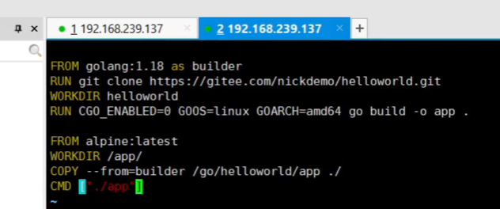
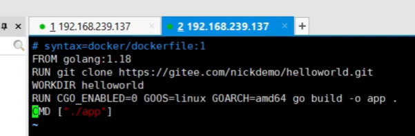
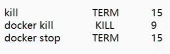

Dockerfile 相关内容

## 1.docker 相关操作技巧

如果 docker 的命令需要添加 sudo 的执行权限，每次都要输入 sudo 比较麻烦，可以通过 id nick 的命令查看当前系统中的用户角色及相关的 group，然后 addgroup -a nick docker，把当前角色加入到 docker 的组中（nick 是角色名）（去掉 sudo）

```shell
id nick

sudo addgroup -a nick docker

sudo service docker restart
```


## 2.如何创建镜像

### 2.1 不使用缓存编译

docker 缓存镜像的规则：每一行 dockerfile 是一层，dockerfile 内容没变 cache 不会变（dockerfile 没改过，他就一直用缓存），可以通过 --no-cache 刷新缓存，强制重新编译


### 2.2 dockerfile 关键词

关键词：
* FROM：使用的基础镜像，其实就是文件系统（root fs）（可以有多个 FROM 作为后面的基础镜像去使用）
* MAINTAINER：作者
* LABEL：tag 版本（todo 1.2）
* RUN：执行的指令
* EXPOSE：容器暴露的端口（可以做映射，但最好不做，更灵活，根据实际情况映射）
* CMD：容器的启动命令
* ENV：容器的环境变量
* ADD：添加网络文件，指定一个路径，下载并添加到容器；tar.gz 自动加压（有些压缩包解压不了，需要注意）
* COPY：只是把宿主机的文件拷贝到容器镜像（不能解压），或者从上一个编译结果 copy 到下一个编译过程（COPY --from）
* entrypoint：容器的入口程序
* volume：过载磁盘
* user：运行的身份
* workdir：工作目录
* arg：编译镜像时可以加入参数
* onbuild：下载一些指令
* stopsignal：容器的退出信号（通过docker history 查看一下）


前一阶段的结果 copy 到第二阶段的编译过程，前面的镜像会被删掉抛弃掉，不占容器的空间，因为已经编译完了，拿到了想要的结果，最终的基础镜像是这个 alpine，只有 11M

这个有 1.1G，所以上面的方法是一个减小镜像大小的手段

docker rm 是删除容器

docker rmi 是删除镜像

注意：镜像就是一个文件系统，不包括内核之类的依赖

### 2.3 干净的 kill 一个容器

通过 docker events 观察

docker stop：本质 kill exitCode=0 signal=3（可以理解为 docker kill 的一种特殊情况，可以感觉的 kill 掉一个进程，可以帮助我们把进程的守卫收拾干净）

docker kill：exitCode=137 signal=9（可能进程终止了，没有去收拾守卫进程）



