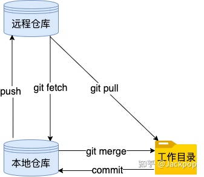

介绍 Git 相关的操作指令

## 1.Git 常用指令

```
切换分支
git checkout test

创建并切换分支
git checkout -b test

拉取更新代码
git pull

查看 git 配置文件（全局）
vi ~/.gitconfig
git config --global --edit

测试 ssh 方式访问 gitlab
ssh -T git@git.n.***.com

查看 ssh 文件
cd ~/.ssh
cat id_rsa.pub

git config 配置
git config --global user.name "newtsun"
git config --global user.email "newtsun@*.com"
git config --global --replace-all user.（如果冲突，可以 ）

```


## 2.`Git fetch` 和 `Git pull` 区别



 **`git fetch`**

在拉取代码过程中，`git fetch`会首先检查本地仓库和远程仓库的差异，检查哪些不存在于本地仓库，然后将这些变动的提交拉取到本地。

但是，这里请注意，它是把远程提交拉取到本地仓库，而不是本地[工作目录](https://www.zhihu.com/search?q=%E5%B7%A5%E4%BD%9C%E7%9B%AE%E5%BD%95&search_source=Entity&hybrid_search_source=Entity&hybrid_search_extra=%7B%22sourceType%22%3A%22answer%22%2C%22sourceId%22%3A2584220174%7D)，它不会自行将这些新数据合并到当前工作目录中，我们需要继续执行`git merge`才会把这些变动合并到当前工作目录。

 **`git pull`**

`git pull`和`git fetch`刚好相反，它直接获取远程的最新提交，直接拉取并合并到本地工作目录，而且在合并过程中不会经过我们的审查，如果不仔细检查，这样很容易遇到冲突。

理解了`git pull`和`git fetch`的区别，那么该用哪种方式呢？

相比之下，`git fetch`是一个更安全的选择，因为它从你的远程仓库拉入所有的提交，但不会对你的本地文件做任何修改。

这给了你足够时间去发现远程仓库自从你上次拉取后到现在为止发生的变化。

你可以在合并前检查哪些文件有变化，哪些文件可能导致冲突。

而`git pull`相当于运行`git fetch`，然后立即将你的改动合并到本地仓库。这样的确少了一个步骤，但是也会带来一些风险。
