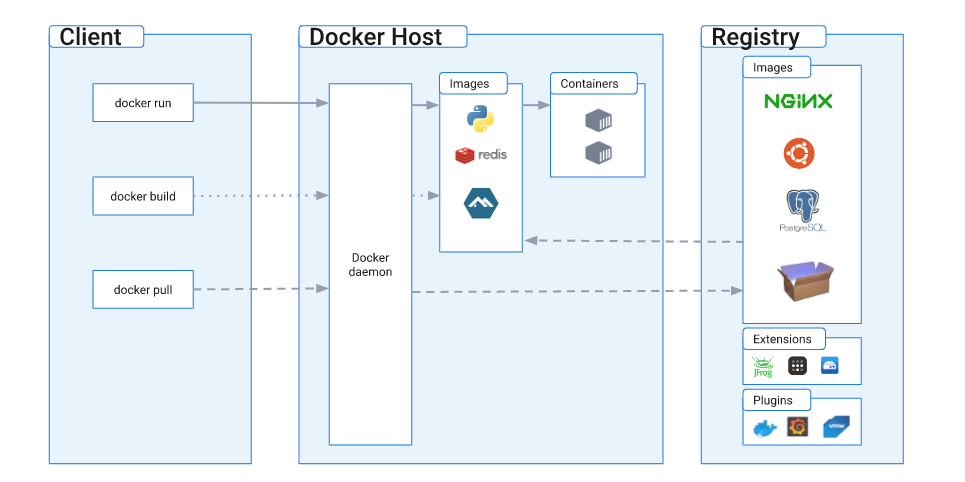

在自己的电脑上配了个 Grafana 的环境，有一些坑，作为记录
## 1.ubuntu 桌面安装 Grafana 前传（Docker）

因为打算在自己电脑上起一个 grafana 的镜像，所以没有使用 portainer 的方式用 compose 去管理、拉取镜像和运行容器（占内存（虽然不大））

### 1.1 Docker 安装



#### 1.1.1 安装 Docker Engine

#### 设置存储库

1. 更新`apt`包索引并安装包以允许`apt`通过 HTTPS 使用存储库：
```shell
sudo apt-get update
sudo apt-get install ca-certificates curl gnupg
```

2. 添加Docker官方GPG密钥：
```shell
sudo install -m 0755 -d /etc/apt/keyrings
curl -fsSL https://download.docker.com/linux/ubuntu/gpg | sudo gpg --dearmor -o /etc/apt/keyrings/docker.gpg
sudo chmod a+r /etc/apt/keyrings/docker.gpg
```

3. 使用以下命令设置存储库：
```shell
echo \
  "deb [arch="$(dpkg --print-architecture)" signed-by=/etc/apt/keyrings/docker.gpg] https://download.docker.com/linux/ubuntu \
  "$(. /etc/os-release && echo "$VERSION_CODENAME")" stable" | \
  sudo tee /etc/apt/sources.list.d/docker.list > /dev/null
```

4. 更新`apt`包索引：
```shell
sudo apt-get update
```

#### 安装 Docker 引擎

1. 安装 Docker 引擎、containerd 和 Docker Compose
```shell
sudo apt-get install docker-ce docker-ce-cli containerd.io docker-buildx-plugin docker-compose-plugin
```

2. 通过运行镜像来验证Docker Engine安装是否成功 `hello-world`
```shell
sudo docker run hello-world
```
如果本地没有该镜像，这个命令将会下载测试镜像，在容器中运行它，打印出 "Hello from Docker"，并且退出

至此，已经成功安装并启动了 Docker Engine
官方文档：https://docs.docker.com/engine/install/ubuntu/

#### 1.1.2 安装 Docker Desktop（非必要）

在 Ubuntu 上安装 Docker Desktop 的推荐方法：

1. 设置 Docker 的包存储库
2. 下载最新的 DEB 包
3. 使用 apt 安装软件包，如下所示：
```shell
sudo apt-get update
sudo apt-get install ./docker-desktop-<version>-<arch>.deb
```

官方文档：https://docs.docker.com/desktop/install/ubuntu/

### 1.2 Docker 设置
#### 1.2.1 添加用户组（以非 root 用户身份管理 Docker）

Docker 守护进程绑定到 Unix 套接字而不是 TCP 端口，默认情况下，Unix 套接字归 root 用户所有，其他用户只能使用sudo，Docker 守护程序始终以 root 用户身份运行

如果不想在 docker 命令前加上 sudo，可以创建 docker 组并将用户添加到其中，当 Docker 守护进程启动时，它会创建一个可供 docker 组成员访问的 Unix 套接字

1. 创建 `docker` 组
```shell
sudo groupadd docker
```

2. 将用户添加到 `docker` 组中
```shell
sudo usermod -aG docker $USER
```
`$USER`是一个环境变量，代表当前用户名

3. 刷新docker组，使其改动直接生效
```shell
newgrp docker
```

#### 1.2.2 将 Docker 配置为开机启动

大多数当前的 Linux 发行版（RHEL、CentOS、Fedora、Debian、Ubuntu 16.04 和更高版本）用于systemd管理系统启动时启动的服务。在 Debian 和 Ubuntu 上，Docker 服务默认配置为在启动时启动。要在启动时为 Docker 和 Containerd自动启动其他发行版，请使用以下命令：
```shell
sudo systemctl enable docker.service
sudo systemctl enable containerd.service
```

要禁用此行为，请改用 `disable`
```shell
sudo systemctl disable docker.service
sudo systemctl disable containerd.service
```

#### 1.2.3 Docker 常用挂载的三种方式

1. **绑定挂载**：绑定挂载是将主机上的文件或目录挂载到容器中。这种挂载方式允许容器与主机之间共享文件和目录，并且对其中一个的更改会直接影响到另一个。可以通过在运行容器时使用 -v 或 --mount 参数来指定绑定挂载，例如：
```shell
docker run -v /host/path:/container/path image_name
```

2. **卷挂载（Volume Mounts）**：卷挂载将 Docker 数据卷挂载到容器中。数据卷是一个可供一个或多个容器使用的特殊目录，用于存储数据和共享数据。它独立于容器的生命周期，容器可以在挂载点读取和写入数据，就像使用普通目录一样。可以通过在运行容器时使用 -v 或 --mount 参数指定卷挂载，例如：
```shell
docker run -v volume_name:/container/path image_name
```

3. **临时文件系统（tmpfs）挂载**：临时文件系统挂载允许将临时文件系统挂载到容器的指定路径。与绑定挂载和卷挂载不同，临时文件系统挂载仅在容器的生命周期内存在，并且不会对主机文件系统产生影响。可以通过在运行容器时使用 --tmpfs 参数来指定临时文件系统挂载，例如：
```shell
docker run --tmpfs /container/path image_name
```

## 2.Grafana 安装（正题）

### 2.1 试错1

```shell
docker run -d -p 3000:3000 -i --name grafana -v /home/static/csv:/var/lib/grafana/static/csv grafana/grafana
```
可以，但是缺少 ini 的映射，以及 grafana local mode has been disabled by your administrator 问题，后文解决

### 2.2 试错2

```shell
docker run --user root -d -p 3000:3000 --name grafana -v /home/static/csv:/opt/static/csv -v /home/swap/grafana:/etc/grafana/grafana.ini grafana/grafana
```
补充 ini 的配置映射后，有权限问题，无法直接映射（during container init: error mounting  to rootfs at "/etc/grafana/grafana.ini": mount /etc/grafana/grafana.ini (via /proc/self/fd/9)）

### 2.3 试错3

关于 grafana local mode has been disabled by your administrator 的问题，根据 ChatGPT 的提示，去设置 `allow_embedding` 或类似的设置来控制本地模式的启用或禁用
```
docker run -d -p 3000:3000 -i --name grafana -v /home/static/csv:/opt/static/csv -e "GF_ALLOW_EMBEDDING=true" grafana/grafana
```
遇到了 Error response from daemon: invalid mode 的错误，使用了无效的模式

### 2.4 解决

开启特权模式，同时允许 csv 相关数据的映射
```
docker run -d -p 3000:3000 -i --name grafana -v /home/static/csv:/opt/static/csv -e "GF_PLUGIN_ALLOW_LOCAL_MODE=true" grafana/grafana
```

更新：由于希望用户（被分享者）可以匿名查看看板（无密码访问）
```
docker run -d -p 3000:3000 -i --name grafana -v /home/static/csv:/opt/static/csv -e "GF_PLUGIN_ALLOW_LOCAL_MODE=true" -e "GF_AUTH_ANONYMOUS_ENABLED=true" grafana/grafana
```

总结：因为偷懒，没有做 grafana.ini 文件的映射，所以采取的是 GF_ 变量覆盖的方式去自定义 Grafana 相关的设置

其他资料：https://www.cnblogs.com/woshimrf/p/docker-grafana.html

## 3.Grafana csv 数据源使用技巧

因为相关数据的敏感性及 Python 大数据操作的便利性，所以存在以 csv 为数据源进行 Grafana 看板展示的需求（所以前面才会折腾本地模式的数据映射，就是为了 csv 数据源做铺垫（不涉及时序））

前面的数据映射已经完成，现在只说一下如何在 Grafana 中配置数据源及相关使用技巧

### 3.1 安装 csv 数据源插件


资料：http://zh-tw.dgrt.cn/a/1664648.html?action=onClick


## 4.Grafana 免密登录

如果使用 ini 修改配置如下：
```ini
[auth.anonymous]
# enable anonymous access
enabled = true         #默认false
 
# specify role for unauthenticated users
org_role = Viewer    #默认Viewer
```

使用环境变量，修改如下：
```shell
GF_AUTH_ANONYMOUS_ENABLED=true
```

资料：（使用环境变量进行配置）
* https://www.freesion.com/article/2928606237/
* https://www.mayanpeng.cn/archives/146.html


