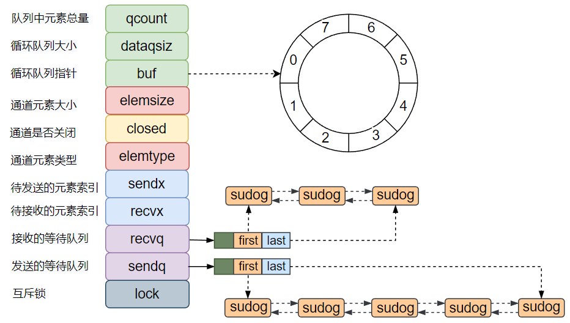

把之前写的一些面经逐渐迁移过来了...

## 1.原子操作

原子操作的意思是说，这个操作在执行的过程中，**其它协程不会看到执行一半的操作结果**。

在**单处理器单核系统**中，即使一个操作翻译成汇编不止一个指令，也有可能保持一致性。比如经常用来演示的并发场景下的 count++ 操作 （count++ 对应的汇编指令就有三条），如果像下面这样写：

```Go
func main() {
    runtime.GOMAXPROCS(1)

    var w sync.WaitGroup
    count := int32(0)
    w.Add(100)
    for i := 0; i < 100; i++ {
        go func() {
            for j := 0; j < 20; j++ {
                count++
            }
            w.Done()
        }()
    }
    w.Wait()
    fmt.Println(count)
}
```

而在**多核系统**中，情况就变得复杂了许多。A核修改 count 的时候，由于 CPU 缓存的存在，B核读到的 count 值可能不是最新的值。如果我们将上面的例子中的第二行改成：

```Go
runtime.GOMAXPROCS(2)
```

之后，程序每执行一次，结果都有可能不一样。

解决思路除了使用前面介绍过的 Mutex，也可以使用今天要介绍的 atomic，具体使用方法是将 count++ 替换成：

```Go
atomic.AddInt32(&count, 1)
```

这样就能保证即使在多核系统下 count++ 也是一个原子操作。

针对一些基本的原子操作，不同的 CPU 架构中有不同的机制来保证原子性，atomic 包将底层不同架构的实现进行了封装，对外提供通用的 API。

atomic 的基础方法：

原子操作主要是两类：**修改**和**加载存储**。修改很好理解，就是在原来值的基础上改动；**加载存储就是读写**。

atomic 提供了 **AddXXX**、**CompareAndSwapXXX**、**SwapXXX**、**LoadXXX**、**StoreXXX** 等方法。

需要注意的是，atomic 的操作对象是地址，所以传参的时候，需要传变量的地址，不能传变量的值。

来源：[https://zhuanlan.zhihu.com/p/359971105](https://zhuanlan.zhihu.com/p/359971105)


## 2.Map 的底层实现

底层是 hmap 结构体，通过调用runtime.makemap函数，主要工作就是初始化 hmap 结构体的各个字段，hmap 里维护着若干个 bucket 数组 (即桶数组)，bucket 数组中每个元素都是 bmap 结构，也即每个bucket（桶）都是bmap结构，每个桶中保存了8个kv对，如果8个满了，会使用 overflow 连接下一个桶(溢出桶)。

- **计算 key 的hash值**
- **通过最后的“B”位来确定在哪号桶**，如果B为4，所以取 key 对应哈希值的后4位
- **根据 key 对应的 hash 值前8位快速确定是在这个桶的哪个位置（tophash）**
- **对比key完整的hash是否匹配**，如果匹配则获取对应value
- **如果都没有找到，就去连接的下一个溢出桶中找**

**扩容方式：**

- **相同容量扩容（元素会发生重排，但不会换桶）**
- **2倍容量扩容（元素会重排，可能会发生桶迁移）**


```Go
 type hmap struct {
     count     int    // 元素的个数
     B         uint8  // buckets 数组的长度就是 2^B 个
     overflow uint16 // 溢出桶的数量

     buckets    unsafe.Pointer // 2^B个桶对应的数组指针
     oldbuckets unsafe.Pointer  // 发生扩容时，记录扩容前的buckets数组指针

     extra *mapextra //用于保存溢出桶的地址
 }

 type mapextra struct {
     overflow    *[]*bmap
     oldoverflow *[]*bmap

     nextOverflow *bmap
 }

 type bmap struct {
     tophash [bucketCnt]uint8
 }

 //在编译期间会产生新的结构体
 type bmap struct {
     tophash [8]uint8 //存储哈希值的高8位
     data    byte[1]  //key value数据:key/key/key/.../value/value/value...
     overflow *bmap   //溢出bucket的地址
 }
```


## 3.sync.Map 的底层实现

sync.Map 的设计利用了 **atmoic** 和 **mutex** 的配合：

- 使用了两个原生的 **map** 作为存储介质，分别是 **read map** 和 **dirty map**（只读字典和脏字典）。
- 只读字典使用 **atomic.Value** 来承载，保证原子性和高性能；脏字典则需要用**互斥锁**来保护，**保证了互斥**。
- 只读字典和脏字典中的键值对集合**并不是实时同步**的，它们在某些时间段内可能会有不同。
- 无论是 read 还是 dirty，本质上都是 **map[interface{}]*entry** 类型，这里的 **entry** 其实就是 **Map** 的 **value** 的容器。
- **entry** 的本质，是一层封装，可以表示具体值的指针，也可以表示 **key** 已删除的状态（即逻辑假删除）

通过这种设计，规避了原生 map 无法并发安全 **delete** 的问题，同时在变更某个键所对应的值的时候，就也可以使用原子操作了

## 4.goroutine 的原理

**基于CSP并发模型开发了GMP调度器：**

**1.G：是`Goroutine`的缩写，是`Goroutine`的控制结构，对 Goroutine 的抽象**。其中包括执行的函数指令及参数；G 保存的任务对象；线程上下文切换，现场保护和现场恢复需要的寄存器(SP、IP)等信息。在 Go 语言中使用 runtime.g 结构表示。

**2.M：是内核线程，由操作系统调度以及管理**，调度器最多可以创建 10000 个线程，在 Go 语言中使用 `runtime.m` 结构表示。（用户线程与内核线程的映射关系）

**3.P：是调度各个`goroutine`，使他们之间协调运行的逻辑处理器**，但不代表真正的CPU的数量，真正决定并发程度的是P，初始化的时候一般会去读取`GOMAXPROCS`对应的值，如果没有显示设置，则会读取默认值，在Go1.5之后GOMAXPROCS被默认设置可用的核数，而之前则默认为1，在 Go 语言中使用 runtime.p 结构表示。

**4.指定cpu线程个数**

通过`runtime.GOMAXPROCS()`，可以指定P的个数,如果没有指定则默认跑满整个cpu

## 5.GMP 调度模型
goroutine 的调度是 Go 语言运行时（runtime）层面的实现，由 Go 语言本身实现的一套调度系统：go scheduler。是按照一定的规则将所有的 goroutine 调度到操作系统线程上执行。目前 Go 语言的调度器采用的是 GPM 调度模型。


- G：表示 goroutine，每执行一次`go f()`就创建一个 G，包含要执行的函数和上下文信息
- 全局队列（Global Queue）：存放等待运行的 G
- P：**是调度各个`goroutine`，使他们之间协调运行的逻辑处理器，表示 goroutine 执行所需的资源**，最多有 GOMAXPROCS 个
- P 的本地队列：同全局队列类似，存放的也是等待运行的G，存的数量有限，不超过256个。新建 G 时，G 优先加入到 P 的本地队列，如果本地队列满了会批量移动部分 G 到全局队列
- M：**是内核线程，由操作系统调度以及管理**，线程想运行任务就得获取 P，从 P 的本地队列获取 G，当 P 的本地队列为空时，M 也会尝试从全局队列或其他 P 的本地队列获取 G。M 运行 G，G 执行之后，M 会从 P 获取下一个 G，不断重复下去
- Goroutine 调度器和操作系统调度器是通过 M 结合起来的，每个 M 都代表了1个内核线程，操作系统调度器负责把内核线程分配到 CPU 的核上执行

**调度器的设计策略：**

**复用线程**：避免频繁的创建、销毁线程，而是对线程的复用

- **work stealing** 机制：当本线程无可运行的G时，尝试从其他线程绑定的P偷取G，而不是销毁线程
- **hand off** 机制：当本线程因为G进行系统调用阻塞时，线程释放绑定的P，把P转移给其他空闲的线程执行

**利用并行**：`GOMAXPROCS`设置P的数量，最多有`GOMAXPROCS`个线程分布在多个CPU上同时运行，`GOMAXPROCS`也限制了并发的程度，比如`GOMAXPROCS = 核数/2`，则最多利用了一半的CPU核进行并行

**抢占**：在 coroutine 中要等待一个协程主动让出CPU才执行下一个协程，**在Go中，一个goroutine最多占用CPU 10ms，防止其他goroutine被饿死，这就是goroutine不同于coroutine的一个地方**

**全局G队列**：在新的调度器中依然有全局G队列，但功能已经被弱化了，当M执行work stealing从其他P偷不到G时，它可以从全局G队列获取G

## 6.channel 的底层实现

channel 的操作封装在 **runtime** 包下的 **chan.go** 文件

```Go
type hchan struct {
    qcount   uint           // channel中环形队列数据总数，len()返回该值
    dataqsiz uint           // 环形队列的长度，make时指定，cap()返回该值
    buf      unsafe.Pointer // 指向环形队列的指针，缓存区基于环形队列实现
    elemsize uint16         // 元素的大小
    closed   uint32         // channel关闭标志
    elemtype *_type         // 元素类型
    sendx    uint           // 向channel发送数据时，写入的位置索引
    recvx    uint           // 从channel读数据时，读取的位置索引
    recvq    waitq          // buf空时，读取的goroutine等待队列
    sendq    waitq          // buf满时，写入的goroutine等待队列

    // lock protects all fields in hchan, as well as several
    // fields in sudogs blocked on this channel.
    //
    // Do not change another G's status while holding this lock
    // (in particular, do not ready a G), as this can deadlock
    // with stack shrinking.
    lock mutex              // 并发控制锁，同一时刻，只允许一个
}

// 等待goroutine的双向链表结构
type waitq struct {
    first *sudog
    last  *sudog
}
```




## 7.unsafe.Pointer 的使用

### 7.1 使用 unsafe.Pointer 做类型转换

可以简洁适宜的转换两个在内存中结构一样的类型是使用 unsafe.Pointer 的一个主要原因。

文档描述：

> 如果T2与T1一样大，并且两者有相同的内存结构；那么就允许把一个类型的数据，重新定义成另一个类型的数据

经典的例子，是文档中的一次使用，用来实现 math.Float64bits：

```Go
func Float64bits(f float64) uint64 {
    return *(*uint64)(unsafe.Pointer(&f))
}
```

这似乎是一种非常简洁的完成这样转换的方法，但是这个过程中具体发生了什么？让我们一步步拆分一下：

- &f 拿到一个指向 f 存放 float64 值的指针。
- unsafe.Pointer(&f) 将 *float64 类型转化成了 unsafe.Pointer 类型。
- (_uint64)(unsafe.Pointer(&f)) 将 unsafe.Pointer 类型转化成了_ uint64。
- _(_uint64)(unsafe.Pointer(&f)) 引用这个 *uint64 类型指针，转化为一个 uint64 类型的值。

第一个例子是下面过程的一个简洁表达：

```Go
func Float64bits(floatVal float64) uint64 {
    // 获取一个指向存储这个float64类型值的指针。
    floatPtr := &floatVal

    // 转化*float64类型到unsafe.Pointer类型。
    unsafePtr := unsafe.Pointer(floatPtr)

    // 转化unsafe.Pointer类型到*uint64类型.
    uintPtr := (*uint64)(unsafePtr)

    // 解引用成一个uint64值
    uintVal := *uintPtr

    return uintVal
}
```

### 7.2 使用 unsafe.Pointer 处理系统调用

当处理系统调用时，有些时候需要传入一个指向某块内存的指针给内核，以允许它执行某些任务。这是 unsafe.Pointer 在 Go 中另一个重要的使用场景。**当需要处理系统调用时，就必须使用 unsafe.Pointer**，因为为了使用 syscall.Syscall 家族函数，它可以被转化成 **uintptr** 类型。

对于许多不同的操作系统，都拥有大量的系统调用。但是在这个例子中，我们将重点关注 ioctl 。ioctl，在UNIX类系统中，经常被用来操作那些无法直接映射到典型的文件系统操作，例如读和写的文件描述符。事实上，由于 ioctl 系统调用十分灵活，它并不在Go的 syscall 或者 x/sys/unix 包中。

让我看看另一个真实的例子。

**现实例子：ioctl / vsock**

在过去的几年里，Linux 增加了一个新的 socket 家族，AF_VSOCK，它可以使管理中心和它的虚拟机之间双向，多对一的通信。 这些套接字使用一个上下文 ID 进行通信。通过发送一个带有特殊请求号的 ioctl 到 /dev/vsock 驱动，可以取到这个上下文 ID。

下面是 ioctl 函数的定义：

```Go
func Ioctl(fd uintptr, request int, argp unsafe.Pointer) error {
    _, _, errno := unix.Syscall(
        unix.SYS_IOCTL,
        fd,
        uintptr(request),
        // 在这个调用表达式中，从 unsafe.Pointer 到 uintptr 的转换是必须做的。详情可以查看 unsafe 包的文档
        uintptr(argp),
    )
    if errno != 0 {
        return os.NewSyscallError("ioctl", fmt.Errorf("%d", int(errno)))
    }

    return nil
}
```

像代码注释所写一样，在这种场景下使用 unsafe.Pointer 有一个很重要的说明：

> 在 syscall 包中的系统调用函数通过它们的 uintptr 类型参数直接操作系统，然后根据调用的详细情况，将它们中的一些转化为指针。换句话说，系统调用的执行，是其中某些参数从 uintptr 类型到指针类型的隐式转换。 如果一个指针参数必须转换成 uintptr 才能使用，那么这种转换必须出现在表达式内部。

但是为什么会这样？这是编译器识别的特殊模式，本质上是指示垃圾收集器在函数调用完成之前，不能将被指针引用的内存再次安排。

你可以通过阅读文档来获得更多的技术细节，但是你在Go中处理系统调用时必须记住这个规则。事实上，在写这篇文章时，我意识到我的代码违反了这一规则，现在已经被修复了。

意识到这一点，我们可以看到这个函数是如何使用的。

在 VM 套接字的例子里，我们想传递一个 *uint32 到内核，以便它可以把我们当时的上下文ID赋值到这块内存地址中。

```Plain Text
f, err := fs.Open("/dev/vsock") if err != nil { return 0, err } defer f.Close()

// 存储上下文ID var cid uint32

// 从这台机器的 /dev/vsock 中获取上下文ID err = Ioctl(f.Fd(), unix.IOCTL_VM_SOCKETS_GET_LOCAL_CID, unsafe.Pointer(&cid)) if err != nil { return 0, err }

// 返回当前的上下文ID给调用者 return cid, nil
```

这只是在系统调用时使用 unsafe.Pointer 的一个例子。你可以使用这么模式发送、接收任何数据，或者是用一些特殊方式配置一个内核接口。有很多可能的情况

