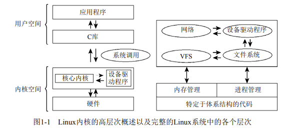
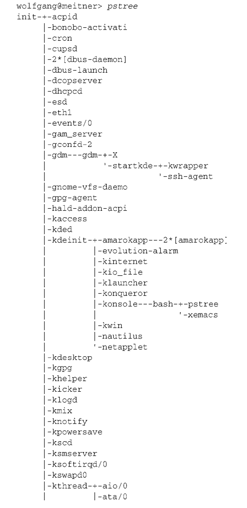

最近计划学习 Linux 内核相关内容，Professional Linux Kernel Architecture

# 第一章：简介及概述

## 1.内核的任务

内核是硬件与软件之间的一个中间层，其作用是将应用程序的请求传递给硬件，并充当底层驱动程序，对系统中的各种设备和组件进行寻址。

* 从应用程序的视角来看，内核可以被认为是一台增强的计算机，将计算机抽象到一个高层次上。例如，在内核寻址硬盘时，它必须确定使用哪个路径来从磁盘向内存复制数据，数据的位置，经由哪个路径向磁盘发送哪一条命令，等等。另一方面，应用程序只需发出传输数据的命令。实际的工作如何完成与应用程序是不相干的，因为内核抽象了相关的细节。应用程序与硬件本身没有联系，只与内核有联系，内核是应用程序所知道的层次结构中的最底层，因此内核是一台增强的计算机。
* 当若干程序在同一系统中并发运行时，也可以将内核视为资源管理程序。在这种情况下，内核负责将可用共享资源（包括CPU时间、磁盘空间、网络连接等）分配到各个系统进程，同时还需要保证系统的完整性。
* 另一种研究内核的视角是将内核视为库，其提供了一组面向系统的命令。通常，系统调用用于向计算机发送请求。借助于C标准库，系统调用对于应用程序就像是普通函数一样，其调用方式与其他函数相同。

## 2.实现策略

* 微内核：这种范型中，只有最基本的功能直接由中央内核（即微内核）实现。所有其他的功能都委托给一些独立进程，这些进程通过明确定义的通信接口与中心内核通信。例如，独立进程可能负责实现各种文件系统、内存管理等。（当然，与系统本身的通信需要用到最基本的内存管理功能，这是由微内核实现的。但系统调用层次上的处理则由外部的服务器进程实现。）理论上，这是一种很完美的方法，因为系统的各个部分彼此都很清楚地划分开来，同时也迫使程序员使用“清洁的”程序设计技术。这种方法的其他好处包括：动态可扩展性和在运行时切换重要组件。但由于在各个组件之间支持复杂通信需要额外的CPU时间，所以尽管微内核在各种研究领域早已经成为活跃主题，但在实用性方面进展甚微。
* 宏内核：：与微内核相反，宏内核是构建系统内核的传统方法。在这种方法中，内核的全部代码，包括所有子系统（如内存管理、文件系统、设备驱动程序）都打包到一个文件中。内核中的每个函数都可以访问内核中所有其他部分。如果编程时不小心，很可能会导致源代码中出现复杂的嵌套。

因为在目前，宏内核的性能仍然强于微内核，Linux仍然是依据这种范型实现的（以前亦如此）。

## 3.内核的组成部分

Linux 是整体式的宏内核：

图1 内核的组成部分

### 3.1 进程、进程切换、调度

各个进程的地址空间是完全独立的，因此进程并不会意识到彼此的存在，从进程的角度来看，它会任务自己是系统中唯一的进程。如果进程想要彼此通信（例如交换数据），那么必须使用特定的内核机制。

由于 Linux 是多任务系统，它支持（看上去）并发执行的若干进程。系统中真正在运行的进程数目最多不超过CPU数目，因此内核会按照短的时间间隔在不同的进程之间切换（用户是注意不到 的），这样就造成了同时处理多进程的假象。

(1) 内核借助于CPU的帮助，负责进程切换的技术细节。必须给各个进程造成一种错觉，即CPU总是可用的。通过在撤销进程的CPU资源之前保存进程所有与状态相关的要素，并将进程置于空闲状态，即可达到这一目的。在重新激活进程时，则将保存的状态原样恢复。进程之间的切换称之为进程切换。 

(2) 内核还必须确定如何在现存进程之间共享CPU时间。重要进程得到的CPU时间多一点，次要进程得到的少一点。确定哪个进程运行多长时间的过程称为调度。

### 3.2 UNIX 进程

Linux对进程采用了一种层次系统，每个进程都依赖于一个父进程。内核启动init程序作为第一个进程，该进程负责进一步的系统初始化操作，并显示登录提示符或图形登录界面（现在使用比较广泛）。因此init是进程树的根，所有进程都直接或间接起源自该进程，如下面的pstree程序的输出所示。其中init是一个树型结构的顶端，而树的分支不断向下扩展。

该树型结构的扩展方式与新进程的创建方式密切相关。UNIX操作系统中有两种创建新进程的机制，分别是fork和exec。

(1) fork可以创建当前进程的一个副本，父进程和子进程只有PID（进程ID）不同。在该系统调用执行之后，系统中有两个进程，都执行同样的操作。父进程内存的内容将被复制，至少从程序的角度来看是这样。Linux使用了一种众所周知的技术来使fork操作更高效，该技术称为写时复制（copy on write），主要的原理是将内存复制操作延迟到父进程或子进程向某内存页面写入数据之前，在只读访问的情况下父进程和子进程可以共用同一内存页。

例如，使用fork的一种可能的情况是，用户打开另一个浏览器窗口。如果选中了对应的选项，浏览器将执行fork，复制其代码，接下来子进程中将启动适当的操作建立新窗口。

(2) exec将一个新程序加载到当前进程的内存中并执行。旧程序的内存页将刷出，其内容将替换为新的数据。然后开始执行新程序。

## 4.内核的特别性

## 5.行文注记

## 6.小结