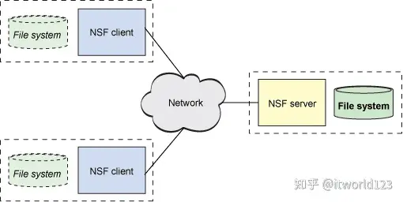
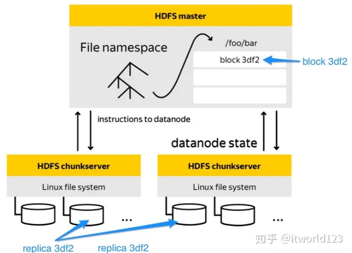
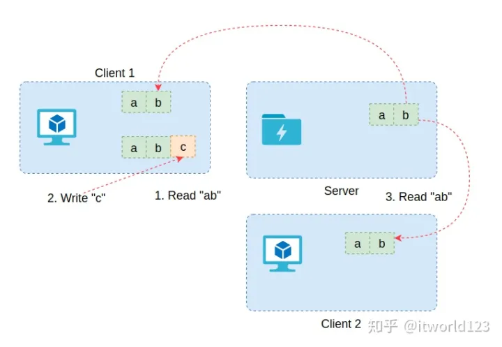

文件系统

## 1.什么是文件系统

> 任何技术的出现是为了解决问题，文件系统也是为了解决某些问题。那文件系统是为了解决什么问题呢？

我们有了一个相对形象的概念，文件系统管理着很多文件。而这些文件其实就是数据，这些数据又是存储在磁盘上的。因此，实质上文件系统是管理磁盘的软件系统，它简化了用户对磁盘空间的使用方法，并降低了磁盘空间的使用难度，通过更加形象的方式将磁盘中的数据展示给用户。 赵二狗窃窃私语：“好啰嗦” 大家对磁盘都比较清楚，其实就是存储数据的地方，我们可以将磁盘与仓库类比。类似一个空仓库，一个没有格式化的磁盘就好像一个空仓库，空间非常大，我们可以随便使用。

磁盘的内部虽然非常复杂，但磁盘生产厂商做了很多工作，将磁盘的复杂性掩盖起来了。对于普通用户来说，磁盘就是一个线性空间，就好像C语言中的数组一样，通过偏移就可以访问其空间（读写数据）。

但是，我们虽然可以直接访问磁盘的空间，如果缺乏规划，那么使用的最终结果可能是这样样子的。数据被毫无规律的放到磁盘上，最后查找的时候会非常费劲，甚至可能找不到需要的数据。

因此，文件系统出现了。文件系统实现对磁盘空间的统一管理，一方面文件系统对磁盘空间进行统一规划，另外一方面文件系统提供给普通用户人性化的接口。就好比仓库中的货架，将空间进行规划和编排，这样根据编号可以方便的找到具体的货物。而文件系统也是类似，将磁盘空间进行规划和编号处理，这样通过文件名就可以找到具体的数据，而不用关心数据到底是怎么存储的。

以Ext4文件系统为例，它将磁盘空间进行划分，并通过元数据实现对磁盘空间的管理。这样，用户对文件的操作就转化为文件系统对磁盘空间的操作。
也就是说，文件系统解决了普通用户使用磁盘存储数据的问题。

## 2.什么是分布式文件系统

上面说的是普通本地文件系统的概念，比如Ext4、XFS、FAT32和Btrfs等文件系统。这些文件系统只能在本地进行磁盘格式化并使用。那么什么是分布式文件系统呢？下面是维基百科给出的定义。

> 相对于本机端的文件系统而言，分布式文件系统（英语：Distributed file system, DFS），或是网络文件系统（英语：Network File System），是一种允许文件透过网络在多台主机上分享的文件系统，可让多机器上的多用户分享文件和存储空间。

通过定义我肯可以看出，分布式文件系统解决的是资源共享的问题。我们先看一个实例，以NFS文件系统为例，它分为服务端和客户端，客户端通过某种协议连接到服务端，此时会在客户端的目录树中映射一个子树，这样在客户端就能访问服务端的文件系统。然而，对于客户端来说，这个目录树关系是透明的，也就是用户不知道这些内容是在远程计算机，也不用关心。

分布式文件系统解决的最大的问题是资源共享的问题，因此分布式文件系统最大的特点是多个客户端可以访问相同的服务端。

图

NFS可以供多个客户端访问，但其毕竟是单机，处理能力是有限的。因此在大规模数据领域，不如电商网站、大数据处理等，采用单机模式无法满足要求。问题有出来了，为了解决这个问题，谷歌开发了GFS分布式文件系统，该文件系统的服务端通过一个集群来实现，客户端可以并发的访问该集群的多达数万个节点，因此承载能力得到极大的提升。 如图10是HDFS的架构图，HDFS是GFS的开源实现，起基本架构是一样的。整个集群的节点分为2中角色，一个是Master节点，负责管理元数据；另外一个是数据节点，负责存储文件的数据。在这种架构中，客户端通过Master节点可以得到文件数据的具体位置，然后可以直接与数据节点交互。由于数据节点可以很多（数万个），因此承载能力得到极大的提升。

除了上述HDFS和GFS等分布式文件系统外，还有GlusterFS、CephFS等很多分布式文件系统，但每种分布式文件系统的细节又有所差异，这个也是与它们所要解决的具体问题相关的。

  

## 3. 什么是集群文件系统

虽然分布式文件系统可以处理高并发访问的问题，但对于同一个文件同时写会存在数据不一致的问题。这个需要客户端的应用做特殊处理。如图11所示，客户端1从服务端读取的某个文件的数据，而此时在客户端进行了追加写操作，由于网络延迟或者什么原因，数据并没有达到服务端。此时，客户端2读取了服务端的数据，显然此时数据是旧数据。如果此时客户端2进行写操作，无法保证服务端最终的数据是客户端1的还是客户端2的，因此存在不可预料的结果。

为了解决同一个文件被不同客户端的应用并发写的问题，这个时候开发了集群文件系统。其中比较著名的是Oracle的OCFS2文件系统。OCFS2通过分布式锁解决了写并发的问题，如果有进程对某个文件的区域进行写操作时会加锁，这样其它客户端如果对相同区域写数据时就必须等待。这样，OCFS2文件系统就保证了数据的一致性。 到此为止，我们介绍文件系统的原理及市面上常见的各种类型的文件系统。通过分析我们看到，不同的文件系统解决的问题是不同的，因此应用场景也是有很大差异的。因此，大家在工作中如果选型时，也需要考虑这些差异。